# Age of Innovation - English rulebook transcription

> Review draft. Source: [English rulebook, version 1.1](source/Age_of_Innovation_rules_EN_V1-1_Web.pdf), 24 pages. Original wording is retained with text-layer errors repaired and tables/lists reflowed. Square-bracketed explanations are transcription notes. Icons are described in words where needed; screenshots contain only component artwork and diagrams, with explanations kept as Markdown. Printed game values, symbols and step numbers remain visible. This is the supplied edition, without later rule changes.

[中文译稿](rules.zh.md) · [Terminology and review notes](rules-review.md)

## Page navigation

- [Page 1: Cover](#page-01)
- [Page 2: Components](#page-02)
- [Page 3: Components, goal and contents](#page-03)
- [Page 4: Game setup](#page-04)
- [Page 5: Game setup: continued](#page-05)
- [Page 6: Personal setup](#page-06)
- [Page 7: General concepts](#page-07)
- [Page 8: Adjacency, reach and power from builds](#page-08)
- [Page 9: Cities and neutral buildings](#page-09)
- [Page 10: Science display and income](#page-10)
- [Page 11: Actions: terraform and build](#page-11)
- [Page 12: Terraforming: continued; build a Workshop](#page-12)
- [Page 13: Upgrade a building](#page-13)
- [Page 14: Sailing, terraforming and innovations](#page-14)
- [Page 15: Scholars, power, books and special actions](#page-15)
- [Page 16: Pass and resource conversion](#page-16)
- [Page 17: Science bonuses and preparation](#page-17)
- [Page 18: Final scoring and drafting variant](#page-18)
- [Page 19: Two-player game and planning displays](#page-19)
- [Page 20: Factions](#page-20)
- [Page 21: Innovation tiles](#page-21)
- [Page 22: Palace tiles](#page-22)
- [Page 23: Round bonuses, actions and cities](#page-23)
- [Page 24: Competencies and round scoring](#page-24)

## Page 1 - Cover

# AGE OF INNOVATION

## A Terra Mystica Game

Helge Ostertag · Alvaro Calvo Escudero

Capstone Games · Feuerland

[Original page 1 (PDF)](source/Age_of_Innovation_rules_EN_V1-1_Web.pdf#page=1)

## Page 2 - Components

### Components

- 1 Game board.
- 6 different Book Action tiles (details on p. 23).
- 1 Science display.
- 2 additional Innovation display sections (to adapt to the player count).
- 1 Innovation display base section.
- 1 Turn Order display.
- 21 City tiles (7 different, 3 of each; details on p. 23).
- 48 Books (12 per color).
- 56 Terrain tiles (2-sided) with 7 different terrains.
- 12 different Factions (details on p. 20).
- 5 Action overviews (same front and back).
- 7 Planning displays (1 per terrain; details on p. 19).
- 7 Planning Display cards.
- 10 Round Bonus tiles (details on p. 23).
- 48 Competency tiles (12 different, 4 of each; details on p. 24).
- 4 Area Score tiles for the 2-player game.
- 12 different Round Score tiles (details on p. 24).
- 4 Final Round Score tiles.

Illustration labels: back; regular; start tiles. The component fronts and backs are shown on page 2 of the source PDF.

[Original page 2 (PDF)](source/Age_of_Innovation_rules_EN_V1-1_Web.pdf#page=2)

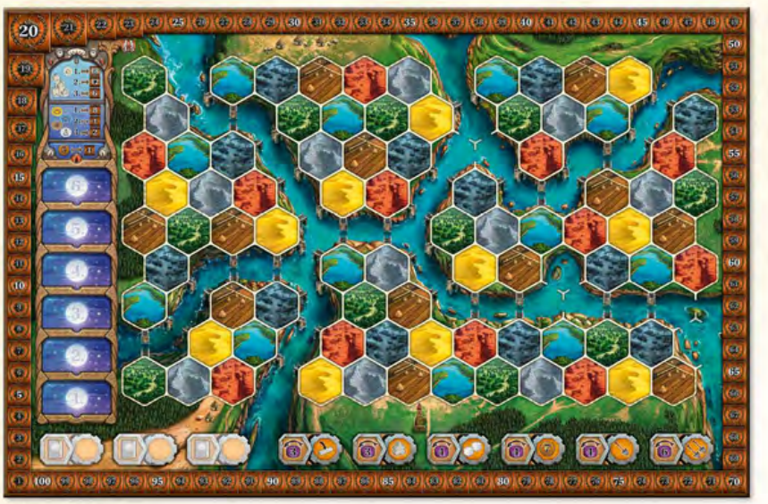

## Page 3 - Components, goal and contents

### Components (continued)

- 18 different Innovation tiles (details on p. 21).
- 17 different Palace tiles (details on p. 22); Palace #17 has a special back.
- 7 Palace Placeholder tiles.
- 7 Point tokens (100/200, front/back).
- 125 Coins (64 × 1, 35 × 2, 26 × 5).
- 20 X-tokens.

Wooden bits in 7 colors (yellow, red, black, blue, green, brown, gray), **per color**:

- 9 Workshops; 4 Guilds; 1 Palace; 3 Schools; 1 University.
- 7 Scholars; 3 Bridges; 2 Track markers; 5 Status markers; 1 Turn Order marker.

Wood in neutral colors (natural colored, purple, white):

- 65 Power tokens; 8 Annexes; 65 Tools (natural colored).
- 1 Workshop; 1 Guild; 1 School; 1 University; 1 Palace; 5 Towers; 1 Monument.

The components for the Automa Solo variant are listed in the corresponding rulebook.

### Goal of the game

Spread out as much as possible on the map with your faction. However, this will require terraforming the terrain so that it is habitable for your faction. Seek proximity to other factions, but don't let them limit you. Gather knowledge, make innovations and acquire competencies. Adapt your gameplay to the variable round objectives and your faction's skills. At the end of the game, the player with the most points wins.

### Terra Mystica Pro?

You already know the rules of Terra Mystica? Then you can also read only the sections marked with [the gold key icon shown in the source]. In these sections the rules have changed or are new.

### Table of contents (original page numbers)

| Section | Page |
| --- | --- |
| Game Setup | 4 |
| General Concepts; Gaining Points; The Power Cycle; Native Terrain and Terraforming | 7 |
| Adjacency and Reach; Gaining Power from Builds | 8 |
| Found a City; Neutral Buildings | 9 |
| Science Display; Gameplay; Phase I: Income | 10 |
| Phase II: Actions; Terraform and Build | 11 |
| Upgrade a Building | 13 |
| Increase Sailing; Upgrade Terraforming; Develop an Innovation | 14 |
| Send a Scholar; Power and Book Actions; Special Actions | 15 |
| Pass; Option: Resource Conversion | 16 |
| Phase III: Science Bonus and Preparation | 17 |
| End of Game and Final Scoring; Variant for Setup | 18 |
| The 2-Player Game; Appendix I: Planning Displays | 19 |
| Appendix II: Factions | 20 |
| Appendix III: Innovation Tiles | 21 |
| Appendix IV: Palace Tiles | 22 |
| Appendix V: Round Bonus Tiles; VI: Power & Book Actions; VII: City Tiles | 23 |
| Appendix VIII: Competency Tiles; IX: Round Score Tiles | 24 |

[Original page 3 (PDF)](source/Age_of_Innovation_rules_EN_V1-1_Web.pdf#page=3)

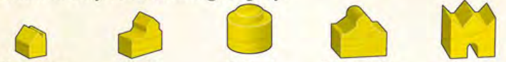

## Page 4 - Game setup

### GAME SETUP

### General Setup

1. Place the game board in the middle of the play area with the side for your player count face up.

The icon depicted on the right shows which side you should use.

Note:

- A 2-player game has additional setup steps. Please find these on page 19 in The 2-player game.

- In a 3-player game choose the game board side for 3-5 players for your first games. If you want a greater challenge, you can also use the side for 1-3 players.

2. Mix the 12 Round Score tiles together face down and randomly select 6 of them to place face up from top to bottom (from 6. to 1.) on the corresponding Round Score spaces on the game board. Return the remaining Round Score tiles to the box; they won't be needed for this game.

The left half of the tiles shows how you may gain points each Round. If you reveal the tile shown on the left [Spades score 2 points] as one of the first two tiles you place, set it aside until you have filled the top two spaces (for Rounds 5 & 6). Then shuffle it back together with the other tiles before you place more tiles. It must not be in either of the top two spaces.

The right half of the tiles show Science Bonuses for your Levels in 4 different Disciplines. Each Discipline appears 3 times.

If you reveal the third (last) tile for a Discipline and none of the tiles are placed in the top Round Score space (for Round 6), don't place this tile. Set it aside and reveal another tile instead. You aren't allowed to place all 3 tiles of the same Discipline in the Round Score spaces for Rounds 1 to 5.

3. Mix the 4 Final Round Score tiles together face down and then randomly place 1 of them face up on top of the Round Score tile for Round 6 so that it hides the Science Bonus on the right side of the tile (which isn't used for the final round). If the Final Round Score tile shows the same type of building as the Round Score tile for Round 6, set it aside and place a different one instead. Return the remaining Final Round Score tiles to the box; they won't be needed for this game.

4. Mix the 6 Book Action tiles together face down and then randomly select 3 of them to place face up on the corresponding Book Action spaces on the game board.

Return the remaining Book Action tiles back to the box; they won't be needed for this game.

5. Place the Turn Order and the Science display next to the game board.

6. Place the base section of the Innovation display next to the game board. Depending on the number of players, add 1 or 2 additional Innovation sections to expand the Innovation display.

Pay attention to the icons for the player count on the front and back of the additional sections.

Illustration labels: 2-player setup; 3-player setup; 4-player setup; 5-player setup.

[Original page 4 (PDF)](source/Age_of_Innovation_rules_EN_V1-1_Web.pdf#page=4)

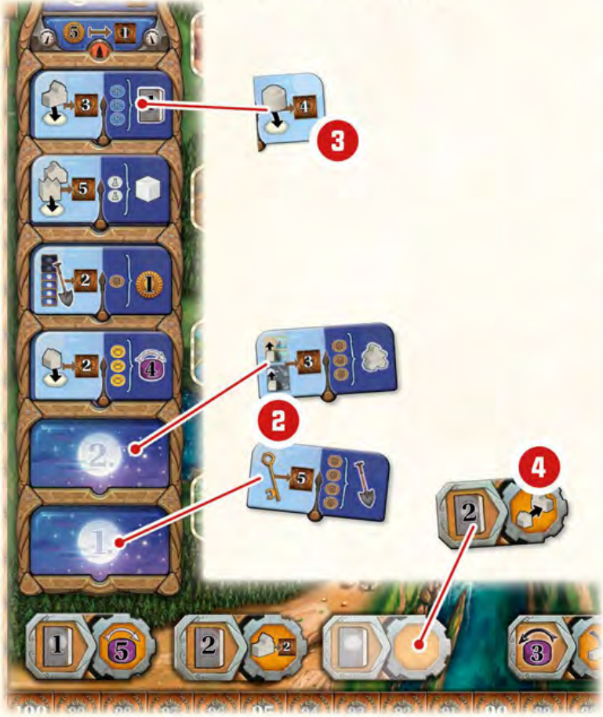

## Page 5 - Game setup: continued

7. Turn the Competency tiles face down, sort out the 12 with the icon shown on the right, then randomly distribute them face up to the Competency spaces at the bottom of the Innovation display. Then place the remaining Competency tiles face up on top of the matching Competency tiles already in place to create 12 stacks, each with 4 Competency tiles of the same type.

8. Mix the 18 Innovation tiles together face down, and randomly place 1 face up on the corresponding Innovation spaces at the top of the Innovation display. Return the rest of the Innovation tiles to the box; they won't be needed for this game.

9. Place the X-tokens, City tiles, Book tiles, Power tokens, Terrain tiles, Tools, and Coins as general supplies near the game board within easy reach. Whenever you gain or spend Book tiles, Power tokens, Tools, or Coins, take them or return them to these general supplies.

10. Place the Neutral buildings near the game board.

11. Find Palace tile #17 with this red back and place it face up next to the game board.

Mix the remaining Palace tiles together face down and place 1 random tile per player plus 1 additional tile face up next to it. Return all remaining Palace tiles back to the box; they won't be needed for this game.

### Faction and Planning Display Distribution

Lay out the 7 Planning Display cards [1]. Then place 1 random Round Bonus tile [2] and 1 random Faction tile [3] face up by each card as a set, for a total of 7 sets (2 random sets are shown here).

Place the remaining 3 Round Bonus tiles next to the game board. Place 1 Coin on each of these.

Randomly determine a Start player.

You can recognize the matching Planning display by the terrain on the Planning Display card being the topmost and largest terrain on the Planning display.

Example:

This Planning Display card represents the yellow Planning display.

Then, beginning with the player to the right of the Start player and continuing counterclockwise, each of you selects one of the available sets, consisting of 1 Planning Display card, 1 Faction tile, and 1 Round Bonus tile. Place it in front of you. Then take the Planning display matching your Planning Display card. For the special features of the Planning displays see Appendix I on page 19.

Return all Planning Display cards, the remaining Planning displays, Faction tiles, and Round Bonus tiles to the box; they won't be needed for this game.

We recommend this type of distribution for your first few games.

However, if you would like to have more choices and flexibility in the distribution, we describe an alternative method in the form of a draft in the section Variant: Drafting Planning Displays and Factions on p. 18.

[Original page 5 (PDF)](source/Age_of_Innovation_rules_EN_V1-1_Web.pdf#page=5)

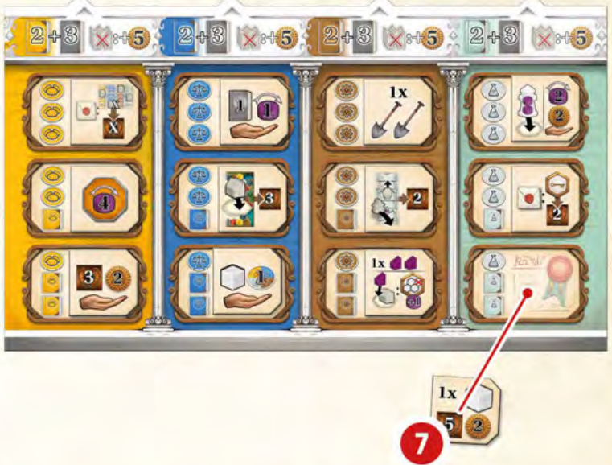

## Page 6 - Personal setup

### Personal Setup

Take all the wooden components matching the color of your Planning display, and 12 Power tokens. Set them up as follows:

1. Place all the buildings of each type on the spaces provided on your Planning display.

Illustration labels: Workshop, Guild, School, University, Palace.

2. Place a Palace Placeholder tile next to your Palace in the indented space so it won't slip.

3. Place your Track markers on the bottom spaces for the Sailing and Terraforming tracks on your Planning display.

4. Place 1 Status marker in each of the Discipline track spaces marked 0 on the Science display. Then advance your markers 1 space for each Discipline icon depicted on your Faction tile and Planning display, if any.

Example: The Moles faction shows 2 icons for the discipline Engineering [brown]. Thus they start on space 2 of this discipline on the Science display.

5. The 3 Power Bowls are in the bottom right of your Planning display. Distribute your 12 Power tokens as indicated into Power Bowls I and II.

6. Place your 7 Scholars and 3 Bridges nearby as a supply.

Take your Scholars from or return them to this supply whenever you gain or spend one. You must gain a Scholar from the supply before you can use it for any action.

7. Take the starting resources indicated in the upper-right corners of your Faction tile and your Planning display.

8. Place your last Status marker in space 20 on the Score track on the game board.

9. Finally, place your Turn Order marker on the Turn Order display. The Start player places their Turn Order marker on the top space of the left column with the Turn Order marker for each successive player in clockwise order placed on the space just below the player before them.

### Placement of Your First Workshops

Beginning with the Start player and continuing in turn order, each player places 1 of their Workshops on a Terrain space on the game board matching the color of their Planning display.

Then in reverse turn order (i.e. beginning with the player who placed last), each player places a second Workshop in the same way. This means the last player in turn order will place 2 Workshops one after the other and the Start player places the first and last Workshop.

[Original page 6 (PDF)](source/Age_of_Innovation_rules_EN_V1-1_Web.pdf#page=6)

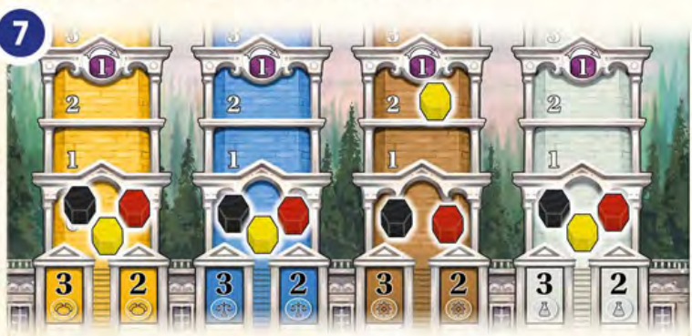

## Page 7 - General concepts

### GENERAL CONCEPTS

### Gaining Points

You will gain points both during the game and for final scoring.

Whenever you see this icon [points], you gain points.

Details for individual game components are all explained in the Appendix (p. 19).

6 Round Score tiles have been setup on the game board, one for each round of the game. Each round, you will score points whenever you perform a specific action.

In the final round, you can also use the additional Final Round Score tile to score whenever you perform a second specific action.

Whenever you found a City during the game, you will gain points and resources for it.

Most of the Innovations tiles you take during the game will gain you points.

Various Palaces, Round Bonuses, and Competencies will allow you to gain points during the game.

At the end of the game, there are 3 final scoring opportunities:

- Majority scores for the most connected buildings.

- Scores for advancement in each of the 4 Disciplines on the Science display

- Scores for your leftover resources.

### The Power Cycle

During the game, you will frequently gain power you need to spend for different actions and resources. Power is represented by Power tokens that cycle through your 3 Power Bowls.

Proper management of your Power Cycle is a core concept and key to success in Age of Innovation.

On your Planning display, there are 3 interconnected Power Bowls through which your Power tokens will cycle. At the beginning of the game, all your Power tokens are in Bowls I and II. Power Bowl III is empty. The Power tokens always cycle clockwise through the Power Bowls.

When you gain power, cycle the Power tokens as follows:

- If there are any Power tokens in Bowl I, gaining 1 power means you can cycle a Power token from Bowl I to Bowl II.

- If Bowl I is empty, gaining 1 power means you can cycle a Power token from Bowl II to Bowl III.

- If both Bowls I and II are empty, you can't cycle any Power tokens and thus may not gain power.

When you want to spend power, you can only use the Power tokens in Bowl III. When spending power, cycle the necessary number of Power tokens from Bowl III to Bowl I.

Example: You gain 3 power.

[1] First you cycle 2 power from bowl I into bowl II.

[2] Bowl I is now empty. Thus you cycle 1 more power from bowl II to bowl III.

A white arrow to the right above a Power token means that you gain a specific amount of power.

A black arrow to the left above a Power token means that you must pay a specific amount of power (cycling Power tokens from bowl III to bowl I).

### Native Terrain and Terraforming

Each Faction is bound to a specific Native terrain (depicted by the large terrain at the top of the Terraforming Circle on the Planning display) and may only construct buildings on hexes with its own Native terrain type. Whether it be deserts, plains, swamps, lakes, forests, mountains, or wastelands, each Faction strives to terraform the terrain on the game board to suit their own needs.

Illustration labels (clockwise from the top): Desert, Plains, Swamp, Lake, Forest, Mountain, Wasteland.

The Terraforming Circle depicts the complexity of terraforming terrain. The large terrain at the top of the terraforming circle is your Native terrain (here: desert). The further another terrain on the Terraforming Circle is from your Native terrain, the more you must pay to terraform it to your Native terrain type.

[Original page 7 (PDF)](source/Age_of_Innovation_rules_EN_V1-1_Web.pdf#page=7)

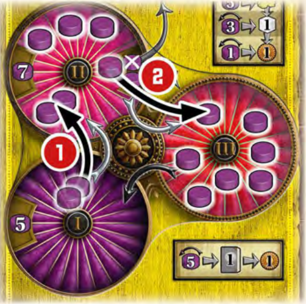

*Power cycle: gain 3 power; move 2 tokens from I to II, then 1 from II to III (source p. 7).*

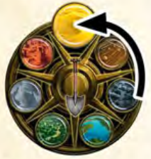

*Terraforming circle and the seven terrain types (figure cropped from source p. 11; the arrow illustrates the shortest path from Swamp to Desert).*

## Page 8 - Adjacency, reach and power from builds

### GENERAL CONCEPTS (continued)

### Adjacency and Reach

You can expand your Faction on the game board by terraforming terrain in a hex that is directly adjacent to a hex with one of your buildings. You may also expand along rivers using Sailing and Bridges. Cities are founded using a group of your own buildings. Building your Guilds will be less expensive if there is a Faction (another player) with an adjacent building. You can also gain power when other Factions build in a hex adjacent to your buildings.

There are two important distinctions for all of these cases:

### Adjacency

All terrain spaces and buildings directly connected to one another by a hex side are adjacent. In addition, hexes and buildings connected via a Bridge across a river are also considered adjacent. (See the Build a Bridge Power action in Appendix VI on p. 23).

Example: These hexes are adjacent due to the bridge. Once a building is built on the second terrain hex, the two buildings will also be considered adjacent.

### Reach

The following are considered to be in reach:

- All adjacent terrain hexes and buildings

- All terrain hexes and buildings connected to each other by a number of river hexes less than or equal to your Sailing value.

Example: These two hexes (Desert and Plains) are in Reach of each other if Yellow has a Sailing value of at least 2.

### Gaining Power from Builds

Whenever you build adjacent to one or more buildings belonging to other Factions, those Factions will gain power. In the same way, you will gain power when other Factions build adjacent to you. A core concept in this game is how to find the right balance between proximity to other Factions and having enough room to expand freely.

The amount of power gained depends on the type of adjacent buildings, because they have different values:

The buildings in the top row of your Planning display (Palace and University) have a Power value of 3.

The buildings in the middle row of your Planning display (Guilds and Schools) have a Power value of 2.

The buildings in the bottom row of your Planning display (Workshops) have a Power value of 1.

Whenever you construct or upgrade a building (see actions Terraform and Build and Upgrade a Building on p. 11-13), other Factions can gain power in return. Each other Faction calculates a total of the Power values for all of their buildings adjacent to the newly built or upgraded building. Each Faction may then decide whether they want to gain exactly that much power or not. Gaining power comes at a cost of points equal to 1 less than the total amount of power gained.

For 1/2/3/4 power, the Faction must spend 0/1/2/3 points.

This series continues in like fashion.

Example: Red builds a Workshop. Thus Yellow could gain a total of 3 power: 1 power from their Workshop and 2 power from the School. Their Guild is not adjacent.

Yellow decides to gain the 3 power and loses 2 points.

Details:

- Whenever you build or upgrade and other Factions could gain power as a result, you must make them aware of the possibility.

- The Power value of the new or upgraded building doesn't play a role in gaining power.

- You can't choose to lose points past 0 on the Score track.

- You are not allowed to take only a portion of the total power

[Original page 8 (PDF)](source/Age_of_Innovation_rules_EN_V1-1_Web.pdf#page=8)

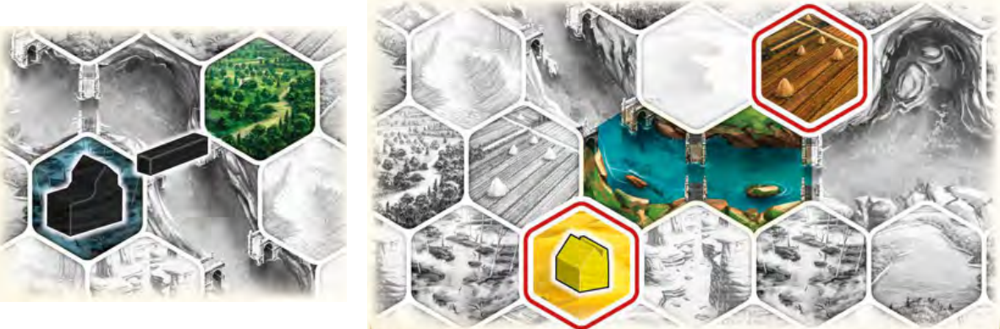

*Bridge adjacency and sailing reach: the example needs Sailing 2 (source p. 8).*

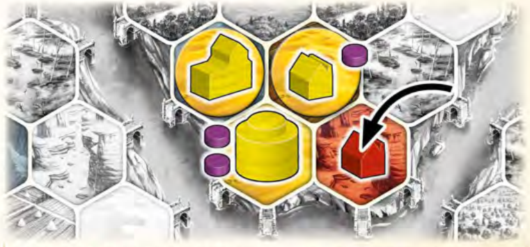

*Building next to an opponent: Yellow may gain 3 power at a cost of 2 points (source p. 8).*

## Page 9 - Cities and neutral buildings

to keep costs in check. You must take all or none of the power. There are two exceptions:

a. If you don't have enough Power tokens in Power Bowls I and II to take all the power, you may continue to take power until you have all your Power tokens in Power Bowl III. Then you must pay 1 point less than the power you gained.

b. If the cost would lower your score below 0, you may only lose enough points to reach 0. Then you would gain power equal to the number of points lost plus 1.

- You only have to give up points for the power you gain from the build actions by other Factions. You don't have to give up points for power from any other sources.

### Found a City

You may found 1 or more Cities during the course of the game. You automatically found a City as soon as:

- you have a group of at least 4 adjacent buildings

- that are not yet part of an existing City

- and that have a total Power value of at least 7.

Exception: A City with a University [1] only needs 3 buildings. A City with a Monument [2] only needs 2 buildings.

Select 1 of the City tiles in the general supply and place it next to one of the buildings in the newly founded City (see Appendix VII on p. 23 for an overview of all the City tiles).

You gain 3 bonuses when you found a City:

1. You immediately gain points as depicted on the selected City tile. If the Round Score tile depicts a Key, you will gain additional points.

With this Round Score tile, gain an additional 5 points for each City founded this round.

2. You immediately gain a one-time bonus in resources or other benefits depicted on the selected City tile.

3. Each City tile provides you with a Key. Keys are necessary to advance to higher Levels on the Science display (see Science Display on p. 10).

Example: These buildings together form a City (4 adjacent buildings, power value 7).

You take the City tile shown and gain 8 points and 8 power for it.

Note: If you build adjacent to one of your existing cities or connect a building to one of your existing cities, the building becomes part of that city. You cannot use it to found another city.

### Neutral Buildings

Some buildings in the game are a neutral color with no Faction affiliation. They can be built by any Faction and will count as that Faction's buildings. These are most commonly gained through Innovations (see Appendix III on p. 21). However, Towers are gained via a Competency (see Appendix VIII on p. 24). In addition, the Omar Faction begins the game with 1 Tower (and they can obtain a second Tower via the Competency).

The following applies to the neutral buildings:

- When you gain a Neutral building, you must immediately place it on the game board. Place it on an empty hex within your reach. If the hex is not your Native terrain, you must first terraform it to your Native terrain (see Terraform and Build on p. 11). However, you may only obtain the required Spades by turning in Tools and not through any other action that gives you free Spades (see Terraform and Build on p. 11). If you can't place it this way immediately, you may not build it at all (even later).

- Placing the building counts as building it (the other Factions may gain power for adjacent buildings of their own).

- This is the only way (except for the Monks' starting ability) you are allowed to build a building other than a Workshop on an empty hex.

- The terrain the building stands on tells you which Faction it belongs to.

Example: You know this Tower belongs to the faction playing black because it is standing on a black Swamp terrain hex.

- Neutral buildings that correspond to player-color buildings are treated as if they are the corresponding building (e.g. regarding the Power value). However, they can't be upgraded. Your income, if there is any, is determined by the tile providing you the building.

- For Neutral buildings that don't correspond to player-color buildings, the Power value for the building is indicated on the tile providing the building.

Example: The Monument (left) has a Power value of 4, the Tower (right) has a Power value of 2.

[Original page 9 (PDF)](source/Age_of_Innovation_rules_EN_V1-1_Web.pdf#page=9)

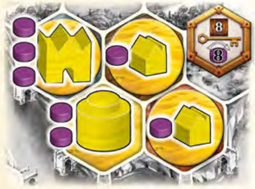

*Founding a city: four adjacent buildings, power value 7, reward 8 points and 8 power (source p. 9).*

## Page 10 - Science display and income

### GENERAL CONCEPTS (continued)

### Science Display

In addition to creating and upgrading buildings, Factions may track their advancement in each of the four Disciplines on the Science display.

The Disciplines are:

Banking [yellow], Law [blue], Engineering [brown], and Medicine [white].

Advancing on the Science display will also allow you to gain additional power and other bonuses.

For each Level you gain in a Discipline, advance your Status marker 1 Level in the corresponding Discipline on the Science display.

When one of your Status markers reaches Level 3, 5, 7, or 12 in a Discipline (even during setup), you immediately gain a one-time power cycling equal to the depicted amount of power.

In order to advance your Status marker to Level 8 in a Discipline, you must already have a City Key (and each Discipline will require a separate City Key). If you are unwilling or unable to use a Key, any extra Levels that you would have gained beyond Level 7 are forfeited.

If your Status marker is at Level 9 or higher in a Discipline, you gain the depicted additional income in Phase I (Income) for each round.

In each Discipline, only 1 Status marker can advance to Level 12. Once Level 12 of a discipline has been reached, no other player can advance to Level 12 of that Discipline.

### GAMEPLAY

A game of Age of Innovation is played over the course of 6 rounds.

Each round consists of the following 3 phases:

1. Phase I: Income
2. Phase II: Actions
3. Phase III: Science Bonuses and Preparation for the Next Round

### Phase I: Income

At the beginning of each round (including the first), you gain Income in the form of new Resources. The icon for Income is an open hand. You gain everything depicted above the open hand.

Income primarily comes from your Planning display.

However, you only gain the Income that is visible, which means it's not covered by a building. You can also gain Income from your Round Bonus tile, your Competencies, your Innovations, and from the Science display.

Take Scholars, Coins, Tools, and Books from the supply.

Your supply of Scholars is limited.

Example: From your Planning display you gain an Income of 1 power, 2 Coins, and 3 Tools from visible icons.

The supply of Coins, Tools, and Books is unlimited. (In the rare event that you run out of these tokens, use any suitable substitute.)

[Original page 10 (PDF)](source/Age_of_Innovation_rules_EN_V1-1_Web.pdf#page=10)

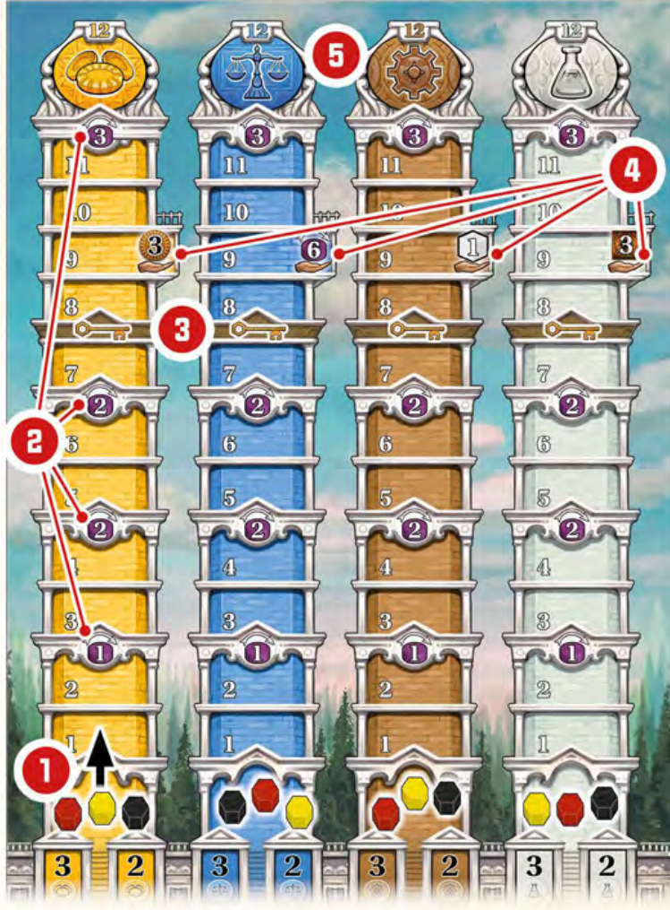

## Page 11 - Actions: terraform and build

### Phase II: Actions

Following the turn order shown on the Turn Order display (starting at the top and working down and then returning to the top again, and so on), players each take their turns performing exactly 1 action, until they take a Pass action. Once all players have passed, the Action Phase ends.

Except for the Pass action, you may perform any action as often as you like and, in any order (but only 1 action per turn). Once you choose the Pass action, your turns are over for the current round. You will be skipped for the rest of the phase until everyone else has also passed.

You may also perform the additional option Resource Conversion immediately before or after any of your actions. This is explained directly after all the actions below (see p. 16).

Each round there will be at least 1 Round Score tile that will allow you to score points for a specific action.

Whenever you perform the action depicted on the left side of the Round Score tile for the current round, you will score the depicted number of points. You can find an overview of all the Round Score tiles in Appendix IX on page 24.

Gain 2 points each time you build a Workshop during a round with this Round Score tile.

The different actions are as follows:

### TERRAFORM AND BUILD

This action allows you to terraform a terrain hex to your Native terrain and build a Workshop there.

Alternatively, you can use this action to build 1 Workshop without terraforming (if the hex is already your Native terrain) or to terraform terrain without building a Workshop.

### Terraform Terrain

In order to build a Workshop, you will often have to terraform the terrain hex on the game board to your Native terrain first.

To terraform terrain, the target hex you want to terraform must be:

- undeveloped (no building),

- within Reach of one of your existing buildings and

- have a terrain type that is not your Native terrain.

Additionally, you must pay the cost for terraforming it.

The Terraforming Circle on your Planning display will show you how complex the terraforming will be. Terraforming a terrain type that is adjacent to your Native terrain type on the Terraforming Circle costs 1 Spade. Terraforming a terrain type that isn't adjacent will cost 2 or 3 Spades, depending on how many steps apart the terrain types are on the Terraforming Circle.

The cost to terraform a Swamp hex into a Desert hex is 2 Spades.

You must always terraform using the shortest path from the target terrain type to your Native terrain. Also, you aren't allowed to count past your Native terrain.

The Spades you need for terraforming can be gained in a number of ways.

Tools can be turned in to gain Spades. The Terraforming track on your Planning display shows how many Tools you have to pay for each Spade. At the beginning of the game, you usually have to pay 3 Tools for 1 Spade. However, you can reduce the costs during the course of the game (see Upgrade Terraforming on p. 14).

You can get Spades (and the right to Terraform and Build) using a variety of actions such as Power, Special, or Book actions. These action types will be explained later.

You can use the Spades to terraform only a single terrain hex during these actions.

3 special cases can occur:

- Buy missing Spades: If and only if the (free) Spades you gain are not enough to terraform the desired terrain into your Native terrain type, you may gain the additional Spades you need by paying Tools (according to the cost shown on your Terraforming track).

- Terraform in steps: Alternatively, you may change the terrain type of the chosen hex to a different terrain type than your Native terrain. In other words, you can perform an intermediate step on the Terraforming Circle, but only in the direction towards your Native terrain type. In this case, you aren't allowed to build a Workshop on this intermediate terrain (because it is not your Native terrain).

- Using 2 or 3 Spades: If you gain 2 Spades at the same time, but only need 1 to terraform the chosen terrain hex to your Native terrain type, you may use the second Spade on another terrain hex within your reach. However, you may only build 1 Workshop on the first terrain.

[Original page 11 (PDF)](source/Age_of_Innovation_rules_EN_V1-1_Web.pdf#page=11)

## Page 12 - Terraforming: continued; build a Workshop

If you gain 3 Spades at the same time, you could even convert up to 3 terrain hexes as long as you always terraform one of them into your Native terrain type first.

Then you may use any remaining Spades on another hex.

In both scenarios: You must use all of your Spades before you build a Workshop. You may not terraform a hex, build the new Workshop and then terraform a new hex that is only in Reach after building that new Workshop.

After paying for the Spades, place a Terrain tile for the new terrain type on the hex (or hexes).

You are not allowed to save Spades for future terraforming.

Spades must always be used immediately.

Spades can also be gained as a Science Bonus (see Phase III on p. 17). Since these Spades are gained outside of the action phase, you aren't allowed to build Workshops immediately after using the Spades. (You must wait for Phase II: Actions in the next Round to build the Workshops.)

You don't necessarily have to build a Workshop on the hex after terraforming. If you don't build one, the hex remains undeveloped and can be terraformed again by any Faction.

A terrain tile with no building on it can be terraformed again.

Example: Yellow uses the depicted power action [1] (see p. 15) and may immediately terraform and build with 2 free spades. Yellow decides to convert the right Plains [2]. Terraforming to the Native Desert terrain only costs 1 Spade, which means Yellow may use the second spade on another terrain. Yellow decides to terraform the left Plains [3] as well. After terraforming, Yellow now builds a Workshop [4] on the first terraformed Plains. Yellow could not have terraformed the lower-right Wasteland [5], because it was not yet adjacent to a yellow building until after the Workshop was placed.

### Build 1 Workshop

To build a Workshop, the terrain hex on which it will be built must be:

- your Native terrain type,

- undeveloped, and

- within Reach of at least 1 of your buildings.

You must also:

- have at least 1 Workshop available on your Planning display, and

- pay the printed cost of 1 Tool and 2 Coins.

After all these requirements have been met, take the leftmost Workshop from your Planning display, and place it on the chosen terrain hex.

This may allow other Factions to gain power if they have buildings adjacent to the new Workshop (see Gaining Power from Builds on p. 8). Remember: When building, players should always remind others of their potential power gains.

Example: You want to terraform and build. Each Spade costs you 3 Tools. To terraform the Mountain into Desert, you have to pay 2 Spades, which is 6 Tools. You pay these Tools and place a Desert terrain tile on the hex. Now you pay the cost of the Workshop, which is 1 Tool and 2 Coins. Then you place the Workshop on the new Desert hex.

[Original page 12 (PDF)](source/Age_of_Innovation_rules_EN_V1-1_Web.pdf#page=12)

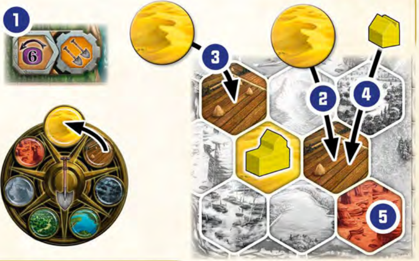

*Two-spade example: terraform both hexes before placing one Workshop (source p. 12).*

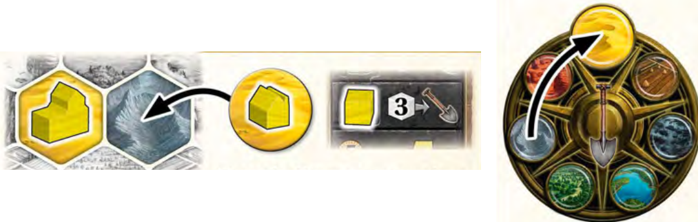

*Terraform Mountain to Desert for 6 Tools, then build for 1 Tool and 2 Coins (source p. 12).*

## Page 13 - Upgrade a building

### UPGRADE A BUILDING

Using this action, you can gradually upgrade your buildings during the game. With 1 action you can upgrade 1 building 1 step.

The upgrade costs are shown to the left of each new building on your Planning display.

The upgrade counts as the build of the new building. This may allow other Factions to gain power if they have buildings adjacent to the upgraded building (see Gaining Power from Builds on p. 8).

The following applies to all upgrades:

- If you don't have a building of the type you want to upgrade to, then you can't upgrade.

- Always take any new building you are placing from the leftmost space on your Planning display.

- Important: For all upgrades, you must exchange the old building for the new building. Take the old building off the terrain hex of the game board and place it back on the rightmost empty space on the corresponding building track on your Planning display.

This reduces the income of the corresponding building type. Then place the new building on the vacated terrain hex of the game board.

There are 4 different upgrades in the game (B and D only once per game).

#### A. Workshop to Guild

Upgrading a Workshop to a Guild costs 2 Tools and 6 Coins. If there is at least 1 building from another Faction adjacent to the Workshop being upgraded, the financial cost is reduced from 6 Coins to 3.

Example: You are Red. Upgrading the left Workshop [1] to a Guild would cost 2 Tools and 3 Coins, because a building of a different Faction is adjacent to it. Upgrading the right Workshop [2] would cost 2 Tools and 6 Coins (your own adjacent building doesn't reduce the cost).

#### B. Guild to Palace

Upgrading a Guild to the Palace costs 4 Tools and 6 Coins. With the construction of the Palace, you also gain a unique ability or Special action (see Appendix IV on page 22 for an overview of all Palace tiles). When you build your Palace, you must first select a Palace tile to replace the Palace Placeholder tile on your Planning display. You can choose from any of the Palace tiles that were placed next to the game board during setup (except those already built by other Factions). This means the later you build your Palace, the fewer choices you'll have in your selection of Palace tiles.

#### C. Guild to School

Upgrading a Guild to a School costs 3 Tools and 5 Coins. Each time you upgrade to a School, you immediately select a Competency tile from the Innovation display and place it face up in front of you. (All Competency tiles are listed in Appendix VIII on page 24.)

The following rules apply whenever you gain a Competency tile:

- You can't take a duplicate Competency tile.

- Depending on the location you take the Competency tile from, you will gain Levels on the Science display and/or Books for the depicted Discipline (always 3 in total).

Example: If you take Competency [1] you gain 3 steps on the Science display in the Discipline Law (blue).

If you take Competency [2] you gain 2 steps on the Science display in the Discipline Engineering (brown) and 1 brown Book from the supply.

#### D. School to University

Upgrading a School to the University costs 5 Tools and 8 Coins. Upgrading to the University also allows you to immediately choose a Competency tile using the same rules as when upgrading to a School.

[Original page 13 (PDF)](source/Age_of_Innovation_rules_EN_V1-1_Web.pdf#page=13)

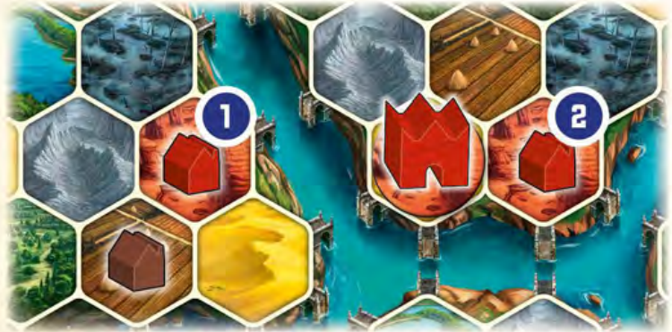

*Guild upgrade: an adjacent opposing building reduces the Coin cost from 6 to 3 (source p. 13).*

## Page 14 - Sailing, terraforming and innovations

### INCREASE SAILING

This action allows you to advance your Track marker 1 space on the Sailing track on your Planning display (unless it is already at the top).

This increases your Reach.

The advancement cost is shown below the Navigation icon.

As a one-time bonus, you will also immediately gain either points or your choice of Books as depicted in the new space.

Example: You pay 1 Scholar and 4 Coins, which allows you to increase your Sailing value from 1 to 2.

As a bonus, you immediately gain 2 Books of any Disciplines.

### UPGRADE TERRAFORMING

This action allows you to advance your Track marker 1 space on the Terraforming track on your Planning display (unless it is already at the top).

This reduces the number of Tools you need to pay for terraforming a terrain type 1 step (See action Terraform and Build on p. 11).

The advancement cost is shown below the Terraforming track. As a one-time bonus, you will also immediately gain either points or your choice of Books as depicted in the new space.

Example: You pay 5 Coins, 1 Tool, and 1 Scholar to reduce the Tools cost for 1 Spade from 2 to 1. As a bonus, you immediately gain 6 points.

### DEVELOP AN INNOVATION

This action allows you to take an Innovation tile by paying the development costs. To take an Innovation tile, you must always pay at least 5 Books, with some requiring specific Disciplines. A gray Book represents a Book of any Discipline.

In addition, if you haven't built your Palace yet, you must also pay 5 Coins.

The available Innovation tiles are in the top section on the Innovation display. They are sorted into columns with their costs at the bottom of the column.

Example: Innovation tiles in this column cost 2 Books of the Banking Discipline and another 3 Books of your choice.

In addition, you must also pay 5 Coins if you haven't built your Palace.

If you are playing with two or four players, the top two Innovations will have different costs.

Example: For the Innovation tiles above this icon you must pay 2 Books of the Banking Discipline, 1 Book of your choice, and 2 Books of the Law Discipline (plus 5 Coins if you haven't built your Palace).

Place the developed Innovation tile in the bottommost empty space on the right side of your Planning display. You may develop up to 3 Innovations during the game.

Once all 3 spaces are occupied, you are no longer allowed to use the Develop an Innovation action.

The space where you place your developed Innovation may show an additional cost of 1 or 2 Books (of your choice) that must be paid in order to place the tile.

There are 3 different kinds of Innovation tiles:

Special abilities, immediate points, and additional Buildings.

An overview of all the Innovation tiles can be found in the Appendix III on page 21.

[Original page 14 (PDF)](source/Age_of_Innovation_rules_EN_V1-1_Web.pdf#page=14)

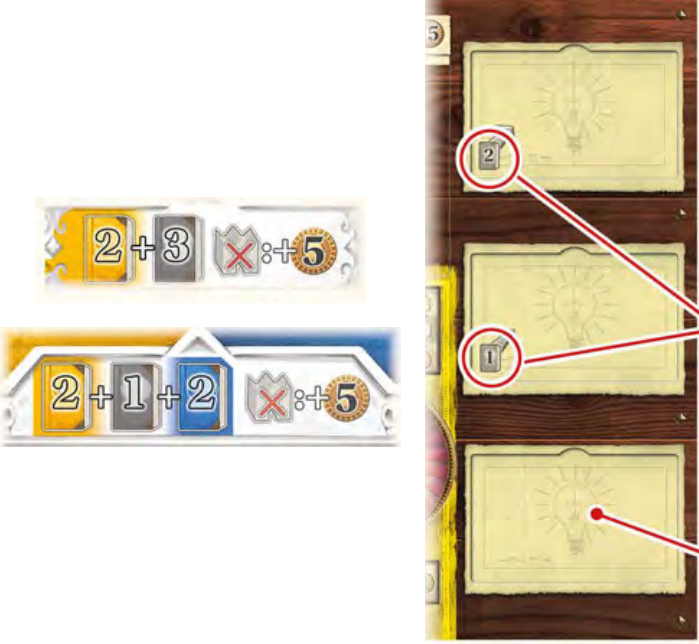

*Innovation costs and the three slots on the Planning display (source p. 14).*

## Page 15 - Scholars, power, books and special actions

### SEND A SCHOLAR

The Science display consists of 4 Discipline tracks: Below each of these tracks are 4 spaces, each of which can host 1 Scholar (each space has a value of 2 or 3).

Illustration labels: Banking, Law, Engineering, Medicine.

This action allows you to place 1 Scholar on any empty space, which in turn allows you to advance your Status marker 2 or 3 Levels for the corresponding Discipline (depending on whether you place your Scholar on a 2 or 3 space).

You can never recover any of your Scholars you have sent to the Science display. Remember, you have a total of only 7 Scholars to use during the game. Use them wisely.

Example: You send a Scholar to the Medicine Discipline.

Since the 3 space is already occupied, you place it on a free 2 space. Then you advance your corresponding Status marker 2 Levels in the Medicine Discipline.

Alternatively, you may return 1 of your Scholars to the supply to advance 1 Level in a Discipline of your choice.

Remember: You must first gain a Scholar from the supply before you can use it for any action.

For more details on the Science display, see the Science Display section on page 10.

### POWER AND BOOK ACTIONS

The spaces for the Power and Book actions are all located along the bottom of the game board (the orange octagons). The Power actions are the same every game, while the Book actions are variable and will change from game to game.

All of these actions along the bottom of the game board can only be used by 1 player each round. Whenever you perform one of these actions, you must place an X-token to cover the orange octagon, which indicates this action can't be taken again this round.

When you select one of the Power actions, you must spend power by cycling the specified number of Power tokens from Power Bowl III to Power Bowl I.

When you select one of the Book actions, you must pay the cost by returning the specified number of Books in any combination of Disciplines. A gray Book represents a Book of any Discipline.

An overview of all the Power and Book actions can be found in Appendix VI on page 23.

Example: In order to activate the Book action on the left, you must return any 2 Books of your choice to upgrade a Workshop to a Guild. In order to activate the Power action on the right, you must cycle 3 Power tokens from Power Bowl III to Power Bowl I, which immediately allows you to build a Bridge. You decide to take the Power action and place an X-token on the corresponding orange octagon.

### SPECIAL ACTIONS

Special actions are available on various components and can be identified by the orange octagon like those for the Power and Book actions. As with the others, these must be covered with an X-token after use because they can only be used once per round.

Unlike the Power and Book actions, Special actions are only available to you and can't be used by other players. They also have no cost to use them.

Example: You have the "Professors" Innovation tile depicted on the left. On your turn, you may use this Special action to gain 1 Scholar from the supply, as well as 3 points, all at no cost. Then you must cover the Special action with an X-token as a reminder you can't use it again until the next round.

[Original page 15 (PDF)](source/Age_of_Innovation_rules_EN_V1-1_Web.pdf#page=15)

## Page 16 - Pass and resource conversion

### PASS

When it is your turn and you can't or don't want to take any other actions, you must Pass. This ends your participation in Phase II: Actions for the current round.

Follow the steps below to Pass. For the final 6th round, only perform Step 1 and skip the rest.

1. Check your Round Bonus tile for the Pass icon.

If present, you will immediately gain the depicted one-time bonus when you Pass (usually points). This works the same way for any other components you have with the Pass icon.

Example:

If you have the depicted Round Bonus tile when you Pass, you gain 4 points for each Palace and University you have on the game board.

If you have the depicted Innovation tile when you pass, you gain 2 points for each Guild you have on the game board.

2. Now take one of the 3 face-up Round Bonus tiles available next to the game board. This can be a Round Bonus tile that was used and returned by another player who passed before you. If there are any Coins on the Round Bonus tile, take those as well. Place your new Round Bonus tile face down in front of you to indicate you have dropped out of the current Round.

Note: You must always take a new Round Bonus tile, because you can't use the same one two rounds in a row.

3. Then return your old Round Bonus tile face up with the other two unclaimed Round Bonus tiles.

4. Finally, move your Turn Order marker to the topmost free space in the column for the next round on the Turn Order display.

The left column on the Turn Order display shows the turn order for odd numbered Rounds and the right column shows the turn order for even numbered rounds.

Example: It is Round 1 and you are the second player to Pass. You move your Turn Order marker from its current space in the left column to space 2 in the right column.

As soon as all players have passed, the Actions phase ends for the current round, and play continues with Phase III: Science Display Bonus and Preparation for the next Round.

### ADDITIONAL OPTION: RESOURCE CONVERSION

In addition to your action, you may freely convert resources on your turn.

You may do this as often as you like before and/or after your action.

You can't convert resources any other way, and you can only convert resources on your own turn.

The following Conversions are available:

### Power Sacrifice

If you have at least 2 Power tokens in Power Bowl II, you may return 1 of them to the supply to cycle another Power token from Power Bowl II to Power Bowl III.

### Power/Resource Conversion

You can convert power to resources. Pay the cost by cycling the corresponding number of Power tokens from Power Bowl III to Power Bowl I.

Or you can pay the depicted resources for different resources.

You have these options:

- Pay 5 power to gain a Scholar or a Book of your choice.

- Pay 3 power to gain 1 Tool.

- Pay 1 power to gain 1 Coin.

- Pay 1 Scholar to gain 1 Tool.

- Pay 1 Tool or 1 Book to gain 1 Coin.

[Original page 16 (PDF)](source/Age_of_Innovation_rules_EN_V1-1_Web.pdf#page=16)

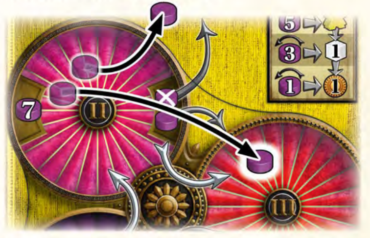

*Power sacrifice: remove one token from II to move another from II to III (source p. 16).*

## Page 17 - Science bonuses and preparation

### Phase III: Science Bonus and Preparation for the Next Round

Phase III begins once all players have passed in the Actions phase. During Rounds 1 to 5 you may gain Science Bonuses and prepare for the next round. However, skip this phase in Round 6, and proceed immediately to End of Game and Final Scoring on page 18.

Perform the following steps in order:

#### 1. Gain Science Bonus

The Science Bonus is depicted on the right half of each Round Score tile (and is covered for the Round 6 Round Score tile, because it will not be used).

Each player now gains the Science Bonus for the current round if they have a number of Levels in a Discipline at least equal to the value depicted. If a player has a value that is twice or three times (or more) the required value, they gain the reward for each multiple of the value.

With Level 3 in the Medicine Discipline, you gain 1 Book of your choice.

With Level 8 in the Engineering Discipline, you gain 2 Spades.

The following rules apply to the Spade Science Bonus:

- Gain your bonuses in the new Turn Order for the next round.
- If you have gained Spades for the Science Bonus, you can't acquire any additional Spades.
- You can't save Spades for the next Round.
- Spades acquired from the Science Bonus may be used on one or more terrain hexes within reach.
- You can't Build a Workshop during Phase III.

#### 2. Remove X-tokens

Remove any used X-tokens from the spaces covered with them:

- the Power and Book actions along the bottom of the game board,
- Special actions on your Palace, Innovation, and Competency tiles,
- the Round Bonus tiles.

#### 3. Place Coins on Round Bonus tiles

Place 1 Coin from the supply on each of the 3 Round Bonus tiles next to the game board. (If a tile hasn't been taken by anyone for two rounds, it will now have 2 Coins on it.)

#### 4. Reveal your Round Bonus tiles

Flip your Round Bonus tiles face up in front of you.

#### 5. Flip Round Score tile

Flip the Round Score tile you just evaluated face down so only the future Round Score tiles are visible.

### Credits

- Game design: Helge Ostertag
- Illustrations: Alvaro Calvo Escudero, Lukas Siegmon
- Graphics design: Christof Tisch
- Editing: Frank Heeren, Bastian Winkelhaus, Christof Tisch, Inga Keutmann
- English Translation: Ralph H Anderson
- Proofreading: Mike Martins, Nathan Morse

We would like to thank Anna Christina Hucke for her support with the typesetting and Andreas Resch for making the 3D game scene.

Representing the many playtesters and supporters, we thank Chris Bizzell, James Ataei, Christian Rossmann, Mike Assante, Reuben Hazelby, Christopher Ho, Alexander Bobrov, Dave Edwards, Francis Birck, Moreira, DocCool, George Galuska, E. Gökce Cimen, Fadi El-Riachi, Allan Jiang, Radhanath Housden, Matthew French.

© 2023 Feuerland Verlagsgesellschaft mbH, Wilhelm-Reuter-Straße 37, 65817 Eppstein. [www.feuerland-spiele.de](https://www.feuerland-spiele.de). Version 1.1.

Capstone Games, 2 Techview Drive, Suite 2, Cincinatti, OH 45215. [www.capstone-games.com](https://www.capstone-games.com).

Distributed in the UK by: Esdevium Games Ltd, trading as Asmodee UK, 6 Waterbrook Road, Alton, GU34 2UD, UK.

Looking for more information or missing something? [Age of Innovation at Capstone Games](https://capstone-games.com/board-games/age-of-innovation/).

[Original page 17 (PDF)](source/Age_of_Innovation_rules_EN_V1-1_Web.pdf#page=17)

## Page 18 - Final scoring and drafting variant

### END OF GAME AND FINAL SCORING

The game ends immediately after Phase II: Actions in Round 6 once everyone has passed. (No Science Bonus is given for Round 6 since it is covered by the additional Final Round Score tile.) Now you will complete final scoring (for Area, Science, and Resources). Players now gain additional points to add to those already gained on the score track during the game.

After all scoring is complete, the player with the most points wins! If tied, the tied players share the win.

### Area Score

Find your largest group of buildings that are all within Reach of each other (see Adjacency and Reach on p. 8). This means each building in this group is within Reach of at least one other building in the group.

Only the number of buildings matters, the type or Power value of the buildings doesn't matter.

- Whoever has the highest number of buildings in their largest group gains 18 points.

- Whoever has the second highest number of buildings in their largest group gains 12 points.

- Whoever has the third highest number of buildings in their largest group gains 6 points.

These scores can also be found in the upper-left corner of the game board.

If players tie for having the same number of buildings in their groups, they share the points for a number of places equal to the number of players beginning with the tied place.

(rounded down).

Example: One player has 10 buildings in their largest group, and the other 3 players each have 9 buildings in their largest group. The player with the most buildings gains 18 points. The 3 tied players score the sum of the 2nd and 3rd place divided by the number of players (3): (12+6) ÷ 3 = 6 points each.

### Science Scoring

The following applies to each of the 4 Discipline tracks:

- Whoever has their Status marker at the highest Level relative to the others gains 8 points.

- Whoever has their Status marker at the second highest Level relative to the others gains 4 points.

- Whoever has their Status marker at the third highest Level relative to the others gains 2 points.

These scores are also depicted in the upper-left corner of the game board. You don't gain any points if you are still on the Level 0 space, even if you are only playing with 2 or 3 players.

If there is a tie for the same Level, the points for that Level and the one(s) below it are divided evenly (rounding down).

Example: Since Blue's Status marker is higher than everyone else's for the Banking Discipline track, Blue scores 8 points.

Yellow and Red have both tied for 2nd highest Level in that track, so they add the points for 2nd and 3rd highest and share them equally. They each gain (4+2) ÷ 2 = 3 points.

Black gains no points.

### Resource Scoring

Leftover resources are converted into Coins with the additional option Resource Conversion (See p. 16).

Each group of 5 Coins is worth 1 point.

### VARIANT: DRAFTING PLANNING DISPLAYS AND FACTIONS

If you want more variety in the distribution of the Planning displays, Factions, and other game components during setup, you can replace the Faction and Planning Display Distribution section with the following steps:

1. Shuffle the 7 Planning Display cards and then randomly place 6 of them face up in the play area (leaving 1 Planning display unavailable).

2. Randomly select a number of Faction tiles equal to the number of players plus 1 and place them face up in the play area.

3. Randomly select a number of Palace tiles equal to the number of players plus 1 and place them face up in the play area. Don't use the Palace #17 with the red back side.

4. Randomly select a number of Round Bonus tiles equal to the number of players plus 3 and place them face up in the play area.

5. Return unselected game components from above to the box; they won't be needed for this game.

6. Randomly select a Start player.

7. Beginning with the Start player and continuing clockwise 3 times around the table, each player will choose 1 of the following in any order and place it in front of them:

A Planning Display card, a Faction tile, and a Palace tile.

Then each player takes their matching Planning display and returns the Planning Display card to the box.

8. Now, beginning with the player to the right of the Start player and continuing counterclockwise, each player selects 1 Round Bonus tile and places it in front of them.

Then place the 3 remaining Round Bonus tiles face up next to the game board and place 1 Coin on each of them.

9. Return the Planning Display cards as well as any remaining Planning displays, Factions, and Palace tiles to the box; they won't be needed for this game.

10. Place your Palace tile on your Planning display. (You won't need the Palace Placeholder tiles because you won't choose a Palace tile when you build your Palace; you'll use the Palace tile you already selected, instead.)

[Original page 18 (PDF)](source/Age_of_Innovation_rules_EN_V1-1_Web.pdf#page=18)

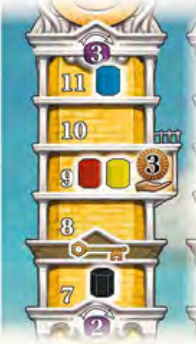

*Science scoring example: Blue 8 points, Yellow and Red 3 each, Black 0 (source p. 18).*

## Page 19 - Two-player game and planning displays

### The 2-player game

If you are playing a 2-player game the following additional rules apply.

#### Changes in the Setup

1. Take the 4 Area Score tiles, shuffle them face down and place 1 of them still face down on the corresponding space on the game board (side for 1-3 players). Return the other three tiles back to the box unseen; they won't be needed for this game.
2. Take 4 Scholars and 4 Status markers of an unused color, to act as a non-player Faction; place them on the Science display as follows:
   - Place 1 Scholar on a 2 space of each Discipline.
   - Place 1 Status marker on Level 2 for each of the 4 Disciplines. Then, using the Science Bonuses on the right side of the Round Score Bonuses for Rounds 1-5, advance the corresponding Discipline markers a number of Levels as shown by the number of Discipline icons. No key is needed in this case to advance to or above Level 8.

Example: The Round 1 Round Score tile grants a Science bonus for each 1 Level in the Banking Discipline (yellow). Advance the neutral marker (here Black) 1 Level there accordingly.

The Round 2 Round Score tile has a Science Bonus for each 3 Levels you have in the Law Discipline (blue). Advance the neutral marker 3 Levels accordingly.

Proceed in the same way for the Science bonuses in Rounds 3 to 5. (There is no Science Bonus in Round 6 so the non-player Faction markers won't be moved.)

#### Changes in Gameplay and Final Scoring

At the beginning of Round 6, reveal the Area Score tile.

At the end of the game, perform the Area and Science Scoring as if there were an additional (non-player) Faction in the game. This Faction doesn't gain any points. However, if the non-player Faction takes first or second place for any of these scorings, the other Factions will score fewer points. Ties are scored as usual.

**Science Scoring:** The markers for the non-player Faction determine their place for scoring for each of the 4 Disciplines.

**Area Scoring:** The number on the Area Score tile indicates how many connected buildings the non-player Faction has in their largest group.

### Appendix I: Planning Display Special Features

| Planning display | Special features |
| --- | --- |
| Desert | At the beginning of the game, after all buildings have been placed, gain 1 free Spade. (If several players gain Spades at this time, use them in playing order. No Workshops may be built at this time.) |
| Forest | At the beginning of the game, advance 1 Level in each Discipline. Begin the game with 8 Power tokens in Bowl II and 4 Power tokens in Bowl I (instead of 7 and 5). |
| Lake | Start the game with Sailing value 1. |
| Mountain | You have an additional income of 2 Coins. Your first Guild gives you an income of 3 Coins (instead of 2). |
| Plains | The action Upgrade Terraforming (p. 14) costs you less. [The pictured cost is 1 Tool, 1 Scholar, and 1 Coin.] |
| Swamp | At the beginning of the game, gain 1 Scholar. Begin the game with 9 Power tokens in Bowl II and 3 Power tokens in Bowl I (instead of 7 and 5). |
| Wasteland | At the beginning of the game, gain 1 Book of your choice and 1 Tool. When you Develop an Innovation, you don't have to pay the additional Book cost for your 2nd Innovation. (You must still pay for the 3rd one.) |

[Original page 19 (PDF)](source/Age_of_Innovation_rules_EN_V1-1_Web.pdf#page=19)

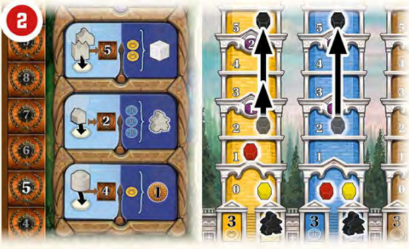

## Page 20 - Factions

### Appendix II: The Factions

### Blessed

At the beginning of the game the Blessed advance 1 Level in each Discipline.

During Phase III, the Blessed gain their Science Bonus as if their Level for that Discipline were 3 Levels higher. This also applies beyond Level 12.

Example: The marker of the Blessed in the Discipline Law is at Level 6.

The Science bonus gives 1 Scholar for every 3 Levels in the Discipline Law.

The Blessed receive 3 Scholars, since their knowledge in Law is considered 3 Levels higher (6+3).

### Felines

At the beginning of the game the Felines advance 1 Level each in the Banking and Medicine Disciplines.

Whenever the Felines found a City, they may advance a total of 3 Levels on the Science display (in 1 or more Disciplines) and gain a Book of their choice.

### Goblins

At the beginning of the game the Goblins advance 1 Level each in the Banking and Engineering Disciplines and gain 1 Tool.

Whenever the Goblins use a Spade, they gain 2 Coins (per Spade).

### Illusionists

At the beginning of the game the Illusionists advance 2 Levels in the Medicine Discipline.

Whenever the Illusionists perform a Power action, they have a discount of 1 power (they cycle 1 less power to Power Bowl I than required by the action). They also gain 3 additional points, or 4 points in a 5-player game.

### Inventors

After placing their first Workshops and choosing a Round Bonus tile at the beginning of the game, the Inventors also choose a Competency tile of their choice (including the corresponding Level advances on the Science display and/or Books). If this Competency tile provides income, this is taken for the first time in Round 1. If this Competency tile provides Spades, use them immediately. (If several players gain Spades at this time, use them in playing order. No Workshops may be built at this time.)

### Lizards

At the beginning of the game the Lizards advance 2 Levels in 1 Discipline of their choice or 1 Level in 2 Disciplines of their choice.

Whenever the Lizards found a City, they gain 1 Terraform and Build action with a free Spade and 1 free Workshop. The Workshop doesn't have to be built on the newly terraformed terrain hex but can be placed on any Native terrain hex in Reach. Otherwise, the usual rules for building a Workshop apply.

### Moles

At the beginning of the game the Moles advance 2 Levels in the Engineering Discipline.

Whenever the Moles perform the Terraform and Build action, they may pay 1 Tool to skip over a terrain or river hex (Tunneling).

They gain 4 points for each time they use Tunneling. Skipping 1 hex means the target hex doesn't have to be adjacent to one of your buildings.

Instead, only 1 of its neighboring hexes must be adjacent. The target hex can't be adjacent to another Mole building. The Moles can Tunnel even if they could also Reach the target hex using Sailing.

During Area Score at the end of the game, Mole buildings count as connected if they can be reached by Tunneling (Tools don't matter for this).

Actions Phase II: As an action, the Moles may pay 1 Tool to build 1 Bridge.

This Bridge can also be built on a terrain hex, which means that one or both hexes to the left and right of the Bridge may also be terrain hexes.

### Monks

At the beginning of the game the Monks advance 1 Level in the Law Discipline.

Additionally, when placing the first Workshops at the beginning of the game, the Monks don't use any Workshops.

Instead, they only place their University.

This placement is made after all the other Factions have made their placements. As usual, the Monks gain a Competency tile of their choice (and the corresponding Levels on the Science display and/or Books) for building their University. If this Competency tile provides income, this is taken for the first time in Round 1. If this Competency tile provides Spades, use them immediately. (If several players gain Spades at this time, use them in playing order. No Workshops may be built at this time.)

### Navigators

At the beginning of the game the Navigators advance 3 Levels in the Law Discipline.

Whenever the Navigators build a Workshop next to a river space, they score 2 points.

### Omar

At the beginning of the game the Omar advance 1 Level each in the Banking and Engineering Disciplines.

Additionally, during placement of the first workshops, the Omar place a third building:

A Neutral Tower. The Tower has a Power value of 2. The Omar place their first and second building at the usual times. Then when all other Factions have placed both their Workshops (and before the Monks have placed their University), they place their third building. They are free to choose the order in which they place their 3 buildings.

Income Phase I: The Omar gain 2 power and 2 Coins.

### Philosophers

At the beginning of the game the Philosophers advance 2 Levels in the Banking Discipline.

Whenever the Philosophers gain a Competency tile, they also gain 1 additional Book of the same Discipline (even if the Competency tile doesn't provide a Book).

Actions Phase II: The Philosophers have a special action that allows them to gain 1 Book of their choice. Cover the Special action with an X-token once you have taken it.

### Psychics

At the beginning of the game the Psychics advance 1 Level each in the Banking and Medicine Disciplines and gain 1 Tool.

Actions Phase II: The Psychics have a Special action that allows them to first gain 5 power and then immediately perform a second action. Cover the Special action with an X-token once you have taken it.

[Original page 20 (PDF)](source/Age_of_Innovation_rules_EN_V1-1_Web.pdf#page=20)

## Page 21 - Innovation tiles

### Appendix III: The Innovation Tiles

### 1. Special Abilities

### Deus Ex Machina

Actions Phase II: You have a Special action that allows you to perform the Terraform and Build action with a free Spade. (You may pay Tools to cover any missing Spades you need to terraform into your Native terrain.) Cover the Special action with an X-token once you have taken it.

As a one-time Bonus, immediately gain 1 Book of your choice and advance 1 Level in each of the 4 Disciplines on the Science display.

### Trading Routes

When you Pass: Gain 2 points for each Guild you have on the board.

### Professors

Actions Phase II: You have a Special action that allows you to gain 1 Scholar and 3 points.

Cover the Special action with an X-token once you have taken it.

### 2. Immediate Points or Bonuses

### Architecture

Immediately and once for each different shape of building you have on the game board, advance 1 Level for free in a Discipline of your choice on the Science display. You may advance in the same or different Disciplines.

Additionally, immediately gain a one-time Bonus of 10 points.

### Census

Immediately gain a one-time bonus of points based on the number of your buildings on the game board: For 7-8 buildings gain 8 points; For 9-10 buildings gain 12 points; For 11+ buildings gain 18 points; If you built less than 7 buildings, you don't gain any points for this Innovation.

### Colleges

Immediately gain a one-time bonus of 5 points for each School you have on the game board.

### Communications

Immediately gain a one-time bonus of points based on the number of building groups you have on the game board. A group consists of 1 or more buildings that are adjacent (see Adjacency and Reach on p. 8). For 4 groups gain 8 points; For 5 groups gain 12 points; For 6+ groups gain 18 points; If you have fewer than 4 building groups, you don't gain any points for this Innovation.

### League of Cities

Immediately gain a one-time bonus of 5 points for each of your City tiles.

### Libraries

Immediately gain a one-time bonus of points based on your two highest-Level Disciplines on the Science display. Gain 1 point for each Level you advanced.

Example: Your Status markers are on Level 9 in Banking, Level 7 in Law and Medicine, and Level 2 in Engineering. You gain (9+ 7) = 16 points.

### Sewerage

Immediately gain a one-time Bonus of 2 points for each of your Workshops on the game board.

### Steam Power

Immediately gain a one-time bonus of 1 Scholar, 1 free upgrade on your Terraforming track and 1 free increase on your Sailing track. Gain the usual rewards for the upgrade/increase.

### Steel

Immediately gain a one-time bonus of points based on the number of bridges you have on the game board. For 1 bridge gain 8 points; For 2 bridges gain 12 points; For 3 bridges gain 18 points. The bridges have to be connected to one of your buildings only.

### 3. Additional Buildings

As a one-time Bonus, each of these Innovations will immediately allow you to place a specific Neutral building.

This Bonus counts as a Build so it may give points and/or trigger Power gains for other Factions. They also count when Passing or for other Innovations.

The usual Neutral building rules apply (see Neutral Buildings on p. 9).

### Workshop

As a one-time bonus, immediately build a Neutral Workshop.

Income Phase I: Gain 3 Tools.

### Guilds

As a one-time bonus, immediately build a Neutral Guild.

Income Phase I: Gain 5 Coins.

### Schools

As a one-time bonus, immediately build a Neutral School.

As a one-time bonus, immediately gain 1 Competency tile of your choice (and the corresponding Discipline Steps and/or Books).

### University

As a one-time bonus, immediately build a Neutral University. Do not gain a Competency.

This University allows you to found a City with only 3 buildings (but still Power value 7).

Income Phase I: Gain 2 points.

### Palace

As a one-time bonus, immediately build a Neutral Palace. Do not gain a Palace tile.

Additionally, as a one-time bonus, immediately add 2 Power tokens to Power Bowl III.

Income Phase I: Gain 4 power.

### Monument

As a one-time bonus, immediately build a Neutral Monument.

The Monument has Power value 4.

The Monument allows you to found a City with only 2 buildings (but still Power value 7).

Additionally, immediately gain 7 points as a one-time bonus.

[Original page 21 (PDF)](source/Age_of_Innovation_rules_EN_V1-1_Web.pdf#page=21)

## Page 22 - Palace tiles

### Appendix IV: The Palace Tiles

#### Palace 1

**Income Phase I:** Gain 5 power.

**Actions Phase II:** You have a Special action that gains you 2 Tools. Cover the Special action with an X-token once you have taken it.

#### Palace 2

**Actions Phase II:** You have a Special action that allows you to perform a Terraform and Build action with 2 free Spades. (You may pay Tools to cover any missing Spades you need to terraform into your Native terrain.) Cover the Special action with an X-token once you have taken it.

#### Palace 3

**Income Phase I:** Gain 2 power.

**Actions Phase II:** You have a Special action that allows you to downgrade a School to a Guild free of charge and in return, you gain 3 points and 1 Tool. This means you put a School back on your Planning display and place a Guild in its place. This counts as Build, so it may give points and/or trigger power gains for other factions. Cover the Special action with an X-token once you have taken it. You can't use this Special action if you don't have a Guild on your Planning display.

#### Palace 4

**Income Phase I:** Gain 2 power.

**Actions Phase II:** You have a Special action that allows you to upgrade a Workshop to a Guild free of charge. This counts as a Build, so it may give points and/or trigger power gains for other factions. Cover the Special action with an X-token once you have taken it.

#### Palace 5

**Income Phase I:** Gain 4 power.

Immediately as a one-time bonus gain 1 Competency tile of your choice for free (and the corresponding Discipline Steps and/or Books).

#### Palace 6

**Income Phase I:** Gain 2 power and 1 Book of your choice.

**Actions Phase II:** You have a Special action that allows you to advance up to 2 Levels in a single Discipline of your choice on the Science display. Cover the Special action with an X-token once you have taken it.

#### Palace 7

**Income Phase I:** Gain 4 power.

**When you Pass:** Gain 3 points for each School you have on the board.

#### Palace 8

**Income Phase I:** Gain 2 Coins, 2 power, and 1 Tool.

You may found Cities with a group of buildings with a total Power value of 6 (instead of 7), but the number of buildings required remains the same (see Found a City on p. 9).

#### Palace 9

**Income Phase I:** Gain 1 Scholar.

Whenever you take the Terraform and Build action, you may fly over 1 or 2 Terrain and/or River hexes by returning 1 Scholar (Flight). Gain 5 points for each Flight.

Flying over 1 or 2 terrain hexes means the target hex doesn't have to be adjacent to one of your buildings. Instead, only 1 of its neighboring hexes must be adjacent (if you fly over 1 hex) or a neighboring hex next to 1 of the target hex's neighboring hexes must be adjacent (if you fly over 2 hexes).

The target hex can't be adjacent to one of your buildings when flying. (You may still use Flight even if the target hex is within Reach.) During Final Area Scoring at the end of the game, your buildings still count as connected if you can reach them by Flight. (Scholars don't matter for this.)

#### Palace 10

**Income Phase I:** Gain 6 Coins.

Immediately gain a one-time bonus of 12 power and 2 Books of your choice when you build this Palace.

#### Palace 11

**Income Phase I:** Gain 1 Tool.

Immediately gain a one-time bonus of 1 City tile of your choice when you build this Palace. Place it on this Palace tile. This City tile doesn't affect the founding of a City on the game board. You can still found a City with your Palace (or it can already be part of a City). For all other effects, this City tile is considered the same as any City tile on the game board. Gaining it is considered founding a city.

#### Palace 12

**Income Phase I:** Gain 8 power.

**Actions Phase II:** Whenever you build a Workshop, gain 2 points.

#### Palace 13

**Actions Phase II:** You have a Special action that allows you to gain 1 Book of your choice as well as 3 Coins. Cover the Special action with an X-token once you have taken it.

**Actions Phase II:** Whenever you build a Guild, gain 3 points.

#### Palace 14

**Income Phase I:** Gain 6 power.

Immediately as a one-time bonus gain 2 free advances on the Sailing track.

Whenever you found a City, you may choose to ignore 1 river hex between your buildings to create your group. (It is up to you whether or when to use this ability on your turn. Whenever you do use this ability, place the City tile in the ignored river hex.)

#### Palace 15

**Income Phase I:** Gain 6 power.

Immediately as a one-time bonus perform a Terraform and Build action with 2 free Spades (You may pay Tools to cover any missing Spades you need to terraform into your Native terrain.), build 2 free bridges (for details see the Power action Build a Bridge on p. 23) and gain 2 Books of your choice. The Books don't have to be of the same Discipline.

You may choose the order in which you take the bonuses, but you may not mix them among each other (e.g. Build a bridge, Terraform and Build, Build a bridge) or with other bonuses (e.g. Terraform and Build, gain a city tile bonus, Build bridges).

#### Palace 16

**Income Phase I:** Gain 2 power and 1 Book of your choice.

Immediately gain a one-time bonus to take and place 1 Guild from your Planning display into any empty hex with your Native terrain on the game board for free. The hex doesn't need to be within your Reach, but you may not terraform it. This counts as a Build, so it may give points and/or trigger power gains for other Factions.

#### Palace 17

**Income Phase I:** Gain 2 power.

Immediately gain a one-time bonus of 10 points when you build this Palace.

This tile has a red back so you can find it more easily during setup.

[Original page 22 (PDF)](source/Age_of_Innovation_rules_EN_V1-1_Web.pdf#page=22)

## Page 23 - Round bonuses, actions and cities

### Appendix V: The Round Bonus Tiles

[Rows separate the ten different tiles. Row numbers are editorial, not printed tile numbers.]

| Tile | Rules |
| --- | --- |
| 1 | **Actions Phase II:** Whenever you build a Workshop next to a river hex, score 2 points. **Actions Phase II:** Your Reach is increased by 1 (don't advance your Sailing Track marker). If you have this Round Bonus tile for Round 6, the increased Reach doesn't apply to Final Scoring. |
| 2 | **Actions Phase II:** Whenever you Send a Scholar, gain 2 points. This also applies if you use the Scholar to advance 1 Level on the Science display by returning it to the supply. **Income Phase I:** Gain 1 Scholar. |
| 3 | **Actions Phase II:** Whenever you build a Guild, gain 3 points. **Income Phase I:** Gain 3 power. |
| 4 | **When you Pass:** Gain 4 points for each University and/or Palace you have on the game board. **Income Phase I:** Gain 1 Tool. |
| 5 | **Actions Phase II:** You have a Special action that allows you to perform a Terraform and Build action with a free Spade. (You may pay Tools to cover any missing Spades you need to terraform into your Native terrain.) Cover the Special action with an X-token once you have taken it. **Income Phase I:** Gain 1 Book of your choice. |
| 6 | **Actions Phase II:** You have a Special action that allows you to place a Bridge for free (similar to the corresponding Power action). Cover the Special action with an X-token once you have taken it. **Income Phase I:** Gain 1 Book of your choice. |
| 7 | **Actions Phase II:** You have a Special action that allows you to advance 1 Level for free in a Discipline of your choice on the Science display. Cover the Special action with an X-token once you have taken it. **Income Phase I:** Gain 2 Tools. |
| 8 | **When you Pass:** Advance 1 Level in the Discipline of your choice for each School you have built. If you have more than one school, you may advance in the same or different Disciplines. **Income Phase I:** Gain 4 Coins. |
| 9 | **Income Phase I:** Gain 4 power and 2 Coins. |
| 10 | **Income Phase I:** Gain 6 Coins. |

### Appendix VI: The Power and Book Actions

#### Book actions

- Return 1 Book of any Discipline to gain 5 power.
- Return 1 Book of any Discipline to advance 2 Levels in a single Discipline of your choice on the Science display.
- Return 2 Books of any Disciplines to gain 6 Coins.
- Return 2 Books of any Disciplines to upgrade a Workshop into a Guild for free. This counts as a Build, so it may gain points and/or trigger Power gains for other Factions.
- Return 2 Books of any Disciplines to gain 2 points for each Guild you have on the game board.
- Return 3 Books of any Disciplines to immediately perform 1 Terraform and Build action with 3 free Spades.

#### Power actions

- Spend 3 power to build a Bridge from one riverbank to the other. You must have a building on at least one of the two terrain hexes you want to connect and there can't be an existing Bridge. This Bridge now makes the two connected terrain hexes adjacent (see Adjacency and Reach on page 8). The Bridge placement options are illustrated on the game board by unfinished bridges.
- Spend 3 power to gain 1 Scholar.
- Spend 4 power to gain 2 Tools.
- Spend 4 power to gain 7 Coins.
- Spend 4 power to immediately perform 1 Terraform and Build action with 1 free Spade. (You may pay Tools to cover any missing Spades you need to terraform into your Native terrain.)
- Spend 6 power to immediately perform 1 Terraform and Build action with 2 free Spades. (You may pay Tools to cover any missing Spades you need to terraform into your Native terrain.)

Example: These are possible places for a Bridge. Since the left and the middle place are next to your Guild, you may place a Bridge there.

### Appendix VII: The City tiles

- When you take this City tile, gain 4 points and 3 Tools.
- When you take this City tile, gain 5 points and immediately perform 1 Terraform and Build action with 2 free Spades. (You may pay Tools to cover any missing Spades you need to terraform into your Native terrain.)
- When you take this City tile, gain 5 points and 2 Books of your choice.
- When you take this City tile, gain 6 points and 6 Coins.
- When you take this City tile, gain 7 points and advance 1 Level in each Discipline.
- When you take this City tile, gain 8 points and 8 power.
- When you take this City tile, gain 8 points and 1 Scholar.

[Original page 23 (PDF)](source/Age_of_Innovation_rules_EN_V1-1_Web.pdf#page=23)

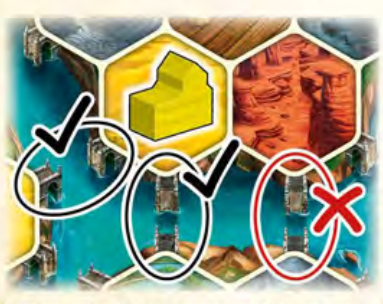

*Bridge example: two legal placements adjacent to your Guild (source p. 23).*

## Page 24 - Competencies and round scoring

### Appendix VIII: The Competency Tiles

[Each numbered item below represents a separate tile. The numbers are editorial, not printed tile numbers.]

1. **Income Phase I:** Gain 1 Tool and advance 1 Level in the Discipline of your choice (if you advance to level 9, gain the corresponding income directly after this).
2. **Immediately:** Gain a one-time bonus of a Terraform and Build action with 2 free Spades. (You may pay Tools to cover any missing Spades you need to terraform into your Native terrain.)
3. Whenever you use the **Send a Scholar** action in **Phase II**, gain 2 points. This also applies when you return a Scholar to the supply to advance 1 Level in a Discipline of your choice.
4. Whenever you build a Workshop on a border hex on the game board, score 3 points. Border hexes have at least 1 dashed side.
5. **Income Phase I:** Gain 3 points and 2 Coins.
6. **Immediately:** Gain 2 Neutral Annexes as a one-time bonus. **As an action in Phase II**, you may place 1 Annex (does not count as a Build) next to one of your buildings without an Annex (also applies to any of your Neutral buildings). The Annex increases the Power value of a building by 1 (for gaining power and to Found a City). In addition, the building and the Annex count as 2 buildings to found a City (towards the usual 4 buildings requirement). An Annex does not count as a building for any other purposes.
7. **Immediately:** Build a Neutral Tower as a one-time bonus. This counts as a Build for other players' power gains. The normal rules for building a Neutral building apply (see Neutral Buildings on page 9). The Tower has Power value 2. **Income Phase I:** Gain 2 power and 2 Coins.
8. **Income Phase I:** Gain 1 Book of your choice and 1 power.
9. **Immediately** gain a one-time bonus of 1 Tool, 5 points, and 2 Coins.
10. **Actions Phase II:** You have a Special action that allows you to gain 4 power. Cover the Special action with an X-token once you have taken it.
11. **When you Pass:** Gain 2 points for each of your City tiles.
12. **When you Pass:** Gain points based on your Levels on the Science display. Gain 1 point for each Level you have in the Discipline where you have the lowest level.

Example [tile 12]: Your Status markers are on Level 9 in Banking, Level 7 in Law and Medicine, and Level 2 in Engineering. You gain 2 points.

### Appendix IX: The Round Score Tiles

Each Round Score Tile on the game board represents 1 round of the game.

The left side of each tile shows how you can gain points for specific actions during Phase II. The right side of the tile shows the Science Bonuses awarded at the end of this round in Phase III. In order to gain these bonuses, you must have advanced your Discipline Level to meet the requirement.

| Actions Phase II | End of Round |
| --- | --- |
| Each time you build a Workshop, gain 2 points. | Gain 1 Scholar for every 3 Levels you have in the Law Discipline. |
| Each time you build a Workshop, gain 2 points. | Gain 4 power for every 3 Levels you have in the Banking Discipline. |
| Each time you build a Guild, gain 3 points. | Gain a Book of your choice for every 3 Levels you have in the Law Discipline. |
| Each time you build a Guild, gain 3 points. | Immediately use 1 Spade for every 4 Levels you have in the Medicine Discipline. (If several players use Spades, use them in the player order for next round. You can't build a Workshop.) |
| Each time you build a School, gain 4 points. | Gain 1 Coin for every Level you have in the Banking Discipline. |
| When you build a Palace or a University, gain 5 points. | Gain 1 Tool for every 2 Levels you have in the Medicine Discipline. |
| Each time you build a Palace or a University, gain 5 points. | Gain 1 Tool for every 2 Levels you have in the Banking Discipline. |
| Each time you spend 1 Spade, no matter how you acquired it, gain 2 points. If you spend multiple Spades, you score for each one spent. **Setup: This tile must not be in the space for round 5 or 6.** | Gain 1 Coin for each Level you have in the Engineering Discipline. |
| Each time you advance a Level in a Discipline on the Science display, gain 1 point. If you Level up several times in 1 action, you will gain 1 point for each Level advanced. | Gain 1 Book of your choice for every 3 Levels you have in the Medicine Discipline. |
| Each time you take a City tile, gain 5 points. | Immediately use 1 Spade for every 4 Levels you have in the Engineering Discipline. (If several players use Spades, use them in the player order for next round. You may not build a Workshop.) |
| Each time you advance your marker on the Sailing or Terraforming track, gain 3 points. | Gain 1 Scholar for every 3 Levels you have in the Engineering Discipline. |
| Each time you take an Innovation tile, gain 5 points. | Gain 3 power for every 2 Levels you have in the Law Discipline. |

### Final Round Score tiles

In Round 6 during Actions Phase II, you will have a Final Round Score tile that will allow you to gain additional points instead of the End of Round Science bonus. The other Final Round Score tiles will score in the same way as the Round Score tiles with the same iconography.

The bonus depicted here allows you to score 3 points each time you build a Workshop on a border hex of the game board. Border hexes have at least 1 dashed side.

[Transcription of the four tile faces shown on p. 2: Workshop build = 2 points; School build = 4 points; border Workshop build = 3 points; Guild build = 3 points.]

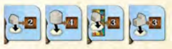

[Original page 24 (PDF)](source/Age_of_Innovation_rules_EN_V1-1_Web.pdf#page=24)
