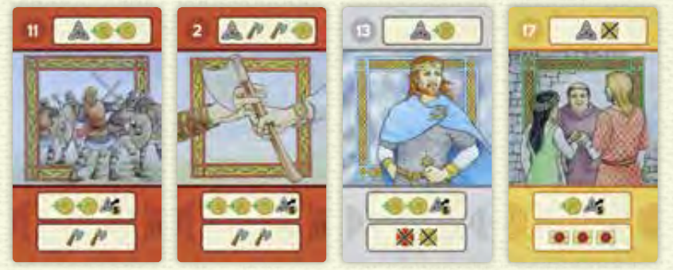
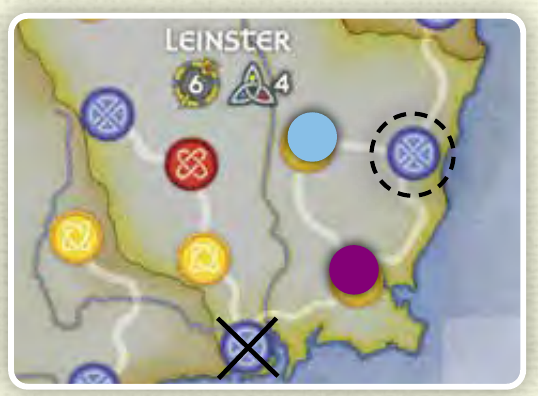
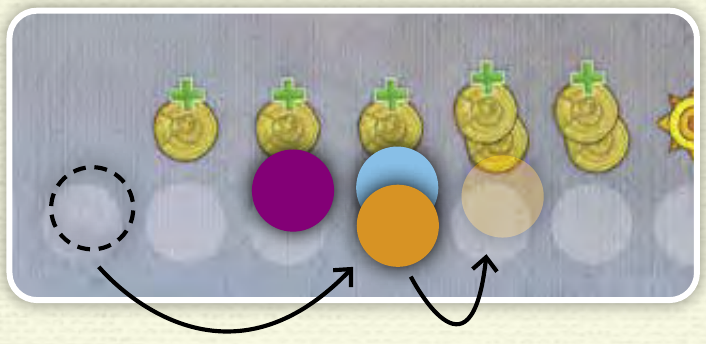

# 布莱恩·博鲁：爱尔兰至高王

依据所提供英文说明书整理的核对后规则文本，含核心流程与书中附录能力；并非所有实体卡牌与板块的逐张转录。文中指定读取组件数值时，以其印刷内容为准，不得臆测未提供的卡牌效果。

## 轮次流程与轮抽

每轮依次进行准备、轮抽、行动、维持。每次轮抽保留两张并向左传牌，行动阶段最后一张手牌不打出。

- 准备：翻开一张维京牌，把指定数量的袭击者放入战斗区，再弃掉该牌；翻开下一张婚姻牌。丹麦公主始终最后出现。

- 洗混全部25张行动牌。三人每人8张、四人6张、五人5张。三或四人时，将未发出的那张牌面朝下放旁边，不得查看。

- 同时选两张面朝下保留，其余向左传，重复此过程。收到的牌只剩一至两张时全部保留；可以查看已选牌，但不能换回。

- 进行到每人只剩一张牌时弃掉该牌，进入维持阶段。因此三／四／五人每轮分别打7／5／4墩；不得翻看公共弃牌堆。

## 谁赢墩，谁先结算？

领出者选择没有圆片的城镇，并打出同色牌或白牌。其他人可出任意牌。同色及白牌中数字最大者赢墩；之后所有人按牌面数字由小到大结算。

- 没有跟色义务。异色牌即使数字最大也不能赢墩；白色王室牌视作目标城镇的颜色。

- 赢家执行牌顶主要行动；每位输家选择牌底的一整项次要行动。所选行动的图标必须从左到右结算。

- 主要行动的城镇图标让你在目标城镇放自己的圆片，并取得目标城镇标记，通常由你领出下一墩。行动结算后弃掉出牌。

争夺红色城镇时，四人分别出红11、红2、白13、黄17。白13赢墩，但结算顺序为2→11→13→17。

## 牌面行动与追加付费

教会、战斗和求婚图标各提供一次基础效果，之后可每付2金币追加一次。扩张必须由对应图标触发，花费5金币。

| 图标 | 结算 |

| --- | --- |

| 金币／划掉的金币 | 获得／归还1金币。只有强制失去金币图标允许在没有金币时改失去2分；连分数也没有则无事发生。 |

| 声望 | 获得1枚声望，保留在自己面前，用于战斗奖励与终局计分。 |

| 教会十字架 | 在教会区放1枚圆片，可每付2金币再放1枚。 |

| 战斧 | 从战斗区拿1枚袭击者，可每付2金币多拿1枚；战斗区已空则无效。 |

| 求婚印章 | 婚姻轨前进1格，可每付2金币再前进1格；到顶后不能继续前进。 |

| 带5的扩张箭头 | 可付5金币，占领与自己控制的城镇有道路直接相连、且没有圆片的城镇，不能越过任何中间城镇。 |

| 划掉的维京控制标记 | 移除版图上一枚维京控制标记，下面圆片的主人重新控制该城镇。 |

蓝色城镇可沿路扩张到右侧空城镇。另一方向被紫色城镇隔断，不能跳过它。

## 婚姻轨：行动结束时不能重叠

先完成整项行动及追加付费，再检查婚姻轨位置。若与他人重叠，向下退到最近的空格；起始格允许多人共存。

- 途中可以经过有人占据的格子；可追加2金币避免停在占用格。

- 维持阶段固定按婚姻→战斗→教会→宣称区域的顺序结算。最后一轮仍完整结算维持，再终局计分。

- 婚姻步骤中，位置最高者拿婚姻牌、立即领取奖励，再回到起始格。若全员都在起始格，无人获牌，直接弃掉。

- 随后各人领取当前格旁的奖励；获牌者已经回到底部，不再获得轨道奖励。其他玩家不重置位置。

- 婚姻牌奖励包括分数、声望、指定区域内无圆片的城镇。若没有合法城镇，该项奖励无效。轨道按图标奖励金币、声望或任意无圆片的城镇。

Peer前进三格后会与Kate重叠。再付2金币可前进到她前面；不付则必须向后退，越过Georgios，停到最近的空格。

## 维京入侵，再发战斗奖励

战斗区若还留有袭击者，持有袭击者最少的每位玩家各失去一个城镇。随后清空战斗区，并发战利品；即使维京入侵成功仍会发奖励。

- 若持有袭击者最多者唯一，由其选择每位输家失去的城镇；若最多者并列，由失城玩家自己选。用维京控制标记盖住圆片，保留下面的原主圆片。

- 战斗区为空则无人失城。奖励前清除该区剩余袭击者；玩家已拿到面前的袭击者与公共战斗区分开计算。

- 第一档：独自持有最多袭击者者获得1声望，按此时全部声望每枚得1分，并归还自己的全部袭击者。若最多者并列，整档跳过。

- 第二档：重新比较玩家手中剩余袭击者，此时最多者（含并列）各得1分并归还1枚。持有0枚者不获战斗奖励，其余未归还的袭击者保留到以后。

## 教会奖励：每档重新比较

先结算唯一领先者，再重新比较剩余领先者，最后检查仍有至少四枚教会圆片的玩家。带修道院的城镇在区域宣称时算作两个城镇。

- 教会圆片最多且唯一的玩家，在自己控制的城镇周围放修道院（若可行），取得目标城镇标记，并收回自己全部教会圆片。若并列，整档跳过。

- 重新比较：此时教会圆片最多者（含并列）各得1分并收回1枚圆片。

- 最后，从目标城镇标记持有者开始顺时针结算：仍有至少4枚教会圆片的人可在可行时放修道院，成功放置后才收回全部剩余圆片。

- 每个城镇最多一个修道院；建造时必须正控制该城镇。未收回的教会圆片保留到以后。

## 解锁与宣称区域

先看区域内已控制的城镇总数是否达到门槛：修道院算两个，维京城镇也计入。再由单独控制最多城镇者拿走已翻面的宣称标记；并列则标记留在原处。

- 逐个检查背面朝上的标记，达到或超过印刷门槛即翻面，之后无需重新解锁。未翻面标记不能取得或计分。

- 所有已翻面标记都要检查，包括玩家已持有的。挑战者必须严格多于原持有人才能夺走；并列不会让已有宣称失效。

- 没有军事同盟时，维京人单独比较城镇数；若其独占最多，标记留在或归还版图。

- 修道院在翻面门槛和多数比较中都算两城，维京人控制的修道院城镇也一样。

## 丹麦公主：三选一

最后的婚姻获胜者立即在军事支援、建立贸易、直接4分中选一。军事与贸易让维京城镇参与的计分项目不同。

| 选择 | 维京城镇计入… |

| --- | --- |

| 军事支援 | 你的区域宣称城镇数，以及版图上已翻面宣称标记的终局计分；不增加终局分布区域数。 |

| 建立贸易 | 你的终局城镇分布区域数；不用于你的宣称标记计分或区域宣称。 |

| 拒绝婚姻 | 弃掉该牌，立即获得4分。 |

## 终局计分与平局

最后一次维持结束后，将金币、先手标记、声望、宣称与区域分布得分加到已有分数，总分最高者获胜。

- 金币独自最多：1分；持有目标城镇标记：1分；每枚声望：1分。

- 你持有的每枚已翻面宣称标记得印刷分数，即使该区域此时并列。未翻面的标记不计分。

- 仍留在版图上的已翻面宣称标记，由该区域城镇数并列最多的所有玩家各得印刷分数的一半，向下取整。仍须计入维京控制及公主同盟的影响。

- 总分平局：先比较持有的宣称标记数，再比较婚姻牌数，仍同分则共享胜利。

| 至少控制一城的区域数 | 分数 |

| --- | --- |

| 1–2 | 0 |

| 3–4 | 1 |

| 5 | 3 |

| 6 | 5 |

| 7 | 7 |

| 8 | 10 |

## 开局设置速查

每人以3金币、1声望、10分开始；各人的起始城镇必须位于不同区域。

- 每人取一种颜色的全部25枚圆片及一张速查牌；婚姻轨起点和计分轨10分各放一枚圆片。标记与圆片不视为数量限制。

- 八枚宣称标记背面朝上放对应槽位；金币、声望、修道院、维京袭击者与维京控制标记分类放公共供应区。

- 将英文丹麦公主放婚姻牌堆底，移除德文重复牌。其余婚姻牌洗混，三人随机放2张在上面，四至五人放3张；其余不看地移除。

- 洗混维京牌。随机选起始玩家，交给他目标城镇标记；顺时针各占一个空城镇，不得选别人已选的起始区域。
