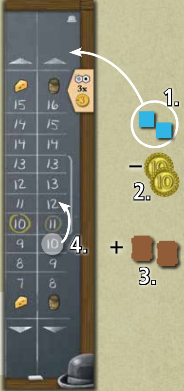
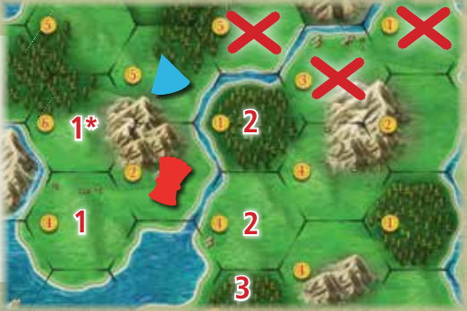
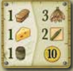
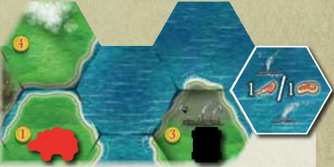
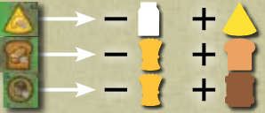
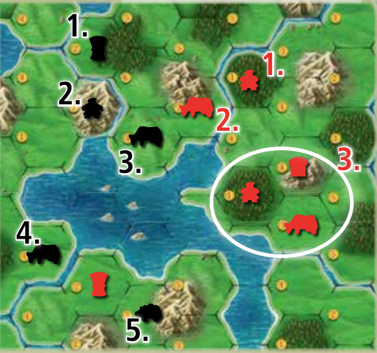
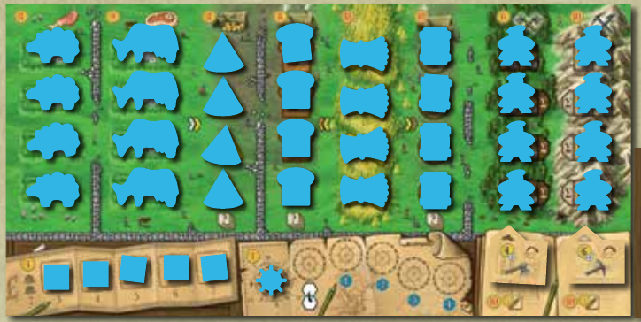

# Clans of Caledonia — organized rules

> Edition: supplied Chinese 2025-06-08 base game, checked against supplied English CC15. This organized rules translation covers setup, core actions, production, scoring, standard clans, ports and optional variants; it is not a verbatim transcription. Source page references are internal. Port 7 follows the 2025 correction. Industria is not included.

## Five rounds; one action per turn

Take one main action when your turn comes around. Keep taking turns until everyone passes, then produce and score.

- Each round: Preparation → Action → Production → Scoring. Skip Preparation in round 1; still produce and score in round 5.
- Preparation: turn over the previous scoring tile, refill empty export-board spaces for the player count, and retrieve your merchants from the market.
- Actions other than Pass may be repeated on later turns, provided you can pay and meet their requirements. Port bonuses are additional free actions on your own turn.

| Action | Main requirement / cost |
| --- | --- |
| Trade | One good type; one merchant per unit traded |
| Obtain an export contract | Empty export box; round-dependent cost |
| Expand | Unit cost + land cost; legal reachable empty space |
| Upgrade shipping | £4 for one step |
| Upgrade technology | £10 for one worker type |
| Hire a merchant | £4; move one from your board to your stock |
| Fulfil an export contract | Pay all its required goods and slaughter any required animals |
| Pass | Take pass money; leave the action phase for this round |

Source pages: 4, 6

## Trade: pay first, then change the price

Buy or sell one type of good at its current market price. Use one available merchant for each unit traded; change the price only after the entire trade.

- Only merchants beside your board are available. Merchants still on the player board must be hired first; merchants at the market stay there until retrieved.
- Pay or receive quantity × the current price. Buying moves the price up that many steps; selling moves it down that many steps, within the printed market track.
- Your merchants may not occupy both the buy and sell areas of the same good. You can repeat a trade in the same direction if you have merchants.
- Goods come from or return to the common supply, not another player. The market trades wool, milk, grain, cheese, bread, and whisky—not meat or imported goods.

Two whisky at £10 each cost £20 and use two merchants. Only then does the price rise to £12.

Source pages: 4

## Obtain an export contract

You normally have room for one unfulfilled contract. Take one from the export board as an action; you must fulfil it before taking another.

- You cannot discard an unfulfilled contract. Clan Buchanan has two export boxes and special rules.
- Empty public contract spaces refill during the next Preparation phase, not immediately after taking one.
- Obtaining and fulfilling a contract are different main actions. A building bonus can obtain a contract during another action, but still uses the normal round cost.

| Round | Cost to obtain |
| --- | --- |
| 1 | Receive £5 |
| 2 | £0 |
| 3 | Pay £5 |
| 4 | Pay £10 |
| 5 | Pay £15 |

Source pages: 4; board image 2

## Expand: reach, terrain and costs

Deploy one unit from the top of its column to an empty space neighbouring or within shipping reach of one of your units. Pay the unit cost plus the printed land cost.

- Each space holds at most one unit. Neighbouring means directly adjacent with no river between the spaces.
- Grassland supports sheep, cows and all four building types; forests support woodcutters; mountains support miners. On mixed terrain, any matching unit is legal.
- Land costs £1–£6. Clan discounts and explicit bonus rules may change the total. Initial workers also cost money.
- An exhausted column cannot supply another unit. Slaughtered animals return to your board and may be deployed again by a later Expand action.

| Unit | Normal unit cost | Required terrain |
| --- | --- | --- |
| Sheep | £8 | Grassland |
| Cow | £9 | Grassland |
| Cheese dairy | £12 | Grassland |
| Bakery | £8 | Grassland |
| Field | £18 | Grassland |
| Distillery | £10 | Grassland |
| Woodcutter | £6 | Forest |
| Miner | £10 | Mountain |

Source pages: 3–5; player-board icons

## Shipping crosses water, not land

Pay £4 to advance shipping by one step. River-crossing reaches the adjacent space across a river; later levels also cross the indicated number of loch spaces.

- Without shipping, you cannot expand across water. Levels progress from none to river-crossing, then 1-, 2-, 3- and 4-loch shipping.
- You can never leap over land, including when following a river. A longer shipping range does not turn an intervening land hex into water.
- On one Expand action, use either a loch crossing or an adjacent river crossing; do not combine the two into a longer route.

Red reaches “1” without shipping, “2” after river-crossing, and “3” with 1-loch shipping. Crossed-out spaces require jumping land. Only “1*” neighbours the blue dairy without a river.

Source pages: 5; publisher FAQ

## Neighbourhood bonus: discounted buying

After expanding next to an opponent with no river between you, you may immediately buy the good that their unit produces from the common supply at a discount.

- Basic goods cost £2 less per unit; processed goods cost £3 less. Use one available merchant per good and move the market price normally afterward.
- The limit is three of the same good per turn, or four in a two-player game—even if you neighbour two units that produce the same good.
- Neighbouring several different producers can let you buy several good types, each with the usual merchant requirement. Workers produce money, not a market good.
- This is an immediate bonus, not a permanent discount. Shipping reach across a river does not grant it. The normal prohibition on buying and selling the same good with your merchants still applies.

Source pages: 5; publisher FAQ

## Fourth factory: building bonus

Deploying the fourth cheese dairy, bakery or distillery can give a building bonus if your export box is empty.

- Draw three contracts from the draw pile. Keep zero or one and return the others to the bottom; pay the normal current-round cost if you take one.
- This is part of the Expand action. Fields, sheep, cows and workers do not trigger this fourth-factory bonus.
- Buchanan draws six and may keep up to two, limited by available export boxes. Taking two in the same bonus costs only once.

Source pages: 5, 11

## Technology, shipping and merchants

Each upgrade or merchant hire normally uses its own action. Technology improves every deployed worker of one type; hiring makes one new merchant available.

- Technology costs £10: flip the corresponding woodcutter or miner tile. That type earns £2 more per worker in each Production phase; it does not pay immediate income.
- Shipping costs £4 per step. Hire a merchant for £4 by moving one from the player board to your available stock; there are seven merchants in your colour, two normally available at the start.
- A bonus upgrade instead offers: technology for £5, shipping free, a new merchant free, or retrieval of one merchant from the market. MacDonald cannot upgrade technology.

Source pages: 5–6

## Fulfil a contract and slaughter animals

Pay all goods on the left of your contract, take the benefits on its right, and move the completed contract beside your export box to free it.

- Beef requires slaughtering a cow; mutton requires slaughtering a sheep. Return each animal from the map to its player-board column. This is part of fulfilling the contract, not a separate action.
- You may not slaughter animals just to clear land or stockpile meat. Slaughter reduces future milk or wool production and frees the space for any legal expansion.
- Contracts never request milk or grain. Imported goods are recorded on fulfilled contracts; they are scoring rewards, not market goods in your stock.
- For cotton, tobacco and sugar cane, advance that good’s global import marker by the amount imported. Reaching or passing a marked reward space grants £1; resolve the marker at fulfilment, not retroactively.

This contract asks for 1 bread, 1 cheese and 1 whisky. It awards 3 tobacco, 2 bonus upgrades and £10.

Source pages: 6

## Resolve export bonuses immediately

Direct export bonuses are money, free land for an expansion, and bonus upgrades. You may resolve these bonuses in any order.

- Money comes from the supply immediately. Free land permits an immediate Expand action without land cost; the unit itself still costs money and all reach/terrain rules apply.
- A free-land expansion can trigger neighbourhood and building bonuses when their conditions are met.
- For each bonus upgrade choose technology at £5, free shipping, a free merchant hire, or retrieving one merchant. With multiple bonus upgrades you may repeat the same eligible option.

Source pages: 6

## Ports: a bonus once per game

A port neighbouring or within shipping reach of one of your units is available as a free bonus on your turn, before or after your main action.

- Use it now or on a later turn, provided you still have access then. You may use several different ports on the same turn.
- After using a port, place your marker by it. Each player may use each port once per game; another player’s marker does not block you.
- The meat-discount port must be used with a contract requiring meat. The price-adjustment port changes one good by three steps before trading it.

Black is directly next to this port. Red needs at least 2-loch shipping to use it from the pictured cow.

Source pages: 6, 10

## Pass money and next round’s order

Passing ends your actions for this round. Put your order marker in the next available position and immediately take the printed pass money.

- The first player to pass is first next round, the second is second, and so on. With four players, pass rewards in order are £16, £14, £12 and £10.
- Use the turn-order track for your player count. If others have passed, the remaining player continues taking one action each turn until also passing.
- You still collect production and round scoring after passing. The passing money in round 5 also matters for the final money score.

Source pages: 3, 6

## Production: income → basics → processing

Only units deployed on the map produce. Collect worker income, then basic goods, then optionally process goods once per factory.

- The empty slots on your player board show deployed production. Money values below workers show cumulative income, not an extra payment to add for each exposed number.
- Processing is optional. You can use milk or grain produced this phase, saved earlier, or bought from the market.
- Each dairy, bakery or distillery processes at most one input per Production phase. Having extra inputs does not let one factory process repeatedly.

| Deployed unit | Production per round |
| --- | --- |
| Woodcutter | £4; £6 with its technology |
| Miner | £6; £8 with its technology |
| Sheep / cow / field | 1 wool / 1 milk / 2 grain |
| Cheese dairy | 1 milk → 1 cheese |
| Bakery | 1 grain → 1 bread |
| Distillery | 1 grain → 1 whisky |

Each factory consumes its input. One grain used for bread cannot also become whisky.

Source pages: 7

## Round scoring happens after production

Score only the current round’s scoring tile, using your state after production. Add its Glory to your track; goods counted are not spent.

- Five scoring tiles are selected and ordered during setup. Some count current stock or units; others count symbols on all your fulfilled contracts.
- For every-two conditions, count complete pairs. A leftover single does not score that pair reward.
- Round scoring is separate from final scoring. Goods kept now can contribute to both if still in stock at the end.

Source pages: 7, 10

## Final score and imported goods

After round 5 production and scoring, total Glory, remaining goods and money, imports, export ranking and settlement ranking. Highest VP wins.

- Cotton, tobacco and sugar cane values depend on everyone’s combined imports. Most imported is worth 3 VP each, middle 4, least 5.
- When import quantities tie, cotton is considered rarer than tobacco, and tobacco rarer than sugar cane. Count your own quantities on completed contracts.
- For ranking ties, share the total points for the occupied places equally, rounding down. In a 3-player export tie for first, two players receive (12+6)/2 = 9 VP each.
- Money left after converting each full £10 to 1 VP breaks a tie on total VP.

| Category | VP |
| --- | --- |
| Glory | 1 per Glory |
| Basic / processed goods in stock | 1 / 2 per good |
| Money | 1 per full £10 |
| Hops on completed contracts | 1 per hops |
| Cotton / tobacco / sugar cane | 3, 4 or 5 each by global rarity |
| Export ranking, 3–4 players | 12 / 6 / 0 / 0 |
| Export ranking, 2 players | 8 / 0 |

Source pages: 7–8

## Settlements: count the connected groups

A settlement is a connected cluster of your units with no river between neighbours. Count how many settlements your largest shipping-connected network contains.

- An isolated unit is a settlement too. Adjacent units separated by a river are in different settlements, but shipping may connect them for scoring.
- Use your actual shipping level. Connections may run through other settlements in the network; disconnected groups are not added together.
- Do not count occupied hexes or the size of one settlement. Slaughtering may split a settlement into more groups, or break the network.

| Players | Settlement ranking VP |
| --- | --- |
| 3–4 | 18 / 12 / 6 / 0 |
| 2 | 12 / 0 |
| Ties | Share the occupied places, round down |

Red has four settlements but only three in one network with 1-loch shipping. Black connects five with 2-loch shipping. The circled red group is one settlement.

Source pages: 8

## Setup and player counts

Assemble the four map modules with A–D clockwise at the centre, choose four ports and five scoring tiles, then select clans and place paid starting workers.

- Use the market, export board and export boxes on the side for your player count. Set prices to the circled starting positions; fill contract spaces, leaving one empty in solo and 3-player games.
- Place each colour’s four of each non-worker unit and eight workers on the player board. Put five merchants on the board, two in the available stock; start with no shipping and unupgraded worker technology unless your clan says otherwise.
- Choose a starting player at random. Draw player count + 1 clans and pair each with a random starting tile. Choose pairs in reverse turn order and take the money and goods printed on the selected starting tile.
- Place one starting worker each in turn order, then a second each in reverse order. Pay worker + land cost both times; the two workers need not neighbour one another. Clan setup exceptions still apply.
- With 1–2 players, mist-shaded edge land is outside the active map, but all lochs remain active. The newly exposed edge is the border for Fergusson and border scoring. Two-player neighbourhood buying caps at four per good.
- Keep game information public. Money and goods are unlimited; use substitutes if the physical tokens run out.

The starting board holds units and five un-hired merchants. Two additional merchants begin beside the board, ready to trade.

Source pages: 1–3, 8

## The eight standard clans

Apply your clan’s exceptions to the normal rules. The ninth clan, MacEwen, is a separately marked Kickstarter variant.

### Buchanan · two export boxes

You have two export boxes. One obtain action can take up to two contracts; one fulfil action can complete up to two. Taking two together costs the round fee once (or gives £5 once in round 1). The building bonus draws six and keeps up to two, including the £5/building-bonus port. Pay separately for separate main/bonus instances: taking one through a port and another through a main action is not one combined purchase.

### Campbell · cheaper factories

For each processed-good factory type separately, the first costs £3 less, the second and third £4 less, the fourth £5 less. This affects cheese dairies, bakeries and distilleries, not fields or land cost. For example, the first bakery costs £5 before land.

### Cunningham · butter from milk

At the end of Production, discard any amount of milk from your stock for £8 each. No merchants are needed and the milk market price does not change.

### Fergusson · three border workers

Start with three workers, all on border spaces and fully paid. Place the third after everyone else has placed their two; the three need not neighbour each other. Start with 2-loch shipping in 3–4 players, or 1-loch in 1–2 players.

### MacDonald · fishermen and rowing

Cover the normal worker area with your clan tile and leave the technology area empty; technology upgrades are unavailable. All eight workers can be woodcutters, miners or fishermen, cost £6 and earn £4 each. Fishermen deploy on empty lochs or port tiles, with no land cost on lochs; no two fishermen may be adjacent. Once per turn, before your main action, row one fisherman to an adjacent loch, obeying placement restrictions. Rowing does not grant a neighbourhood bonus; deploying can. Adjacent land is neighbouring to a fisherman, but crossing lochs to expand still needs shipping. In 1–2 players start with river-crossing shipping.

### MacKenzie · whisky and the cellar

Gain £3 for each whisky produced without discarding it. At the start of Production move cellar barrels one step right; a barrel already at the rightmost position exits to stock. Barrels may be withdrawn to stock at any time: aged positions award £7 or £15 when withdrawn. At the end of Production put at most one freshly produced whisky in the leftmost cellar position. Cellar whisky counts for the processed-goods round-scoring tile.

### Robertson · river deltas

When placing a unit on a river-delta space (next to a river directly entering a loch), reduce the total unit-plus-land cost by £3 in 3–4 players or £2 in 1–2 players. This also applies to starting workers.

### Stewart · trading income

Start with five available merchants and river-crossing shipping. Each market trade gives £1, before paying for a purchase, regardless of the quantity. If a neighbourhood bonus trades several good types, gain £1 for each type.

Source pages: 11–12

## Port tile effects

Each effect below is a once-per-player-per-game bonus from a reachable port. The exchange port uses the updated rule allowing both placement bonuses.

### 1 · One less animal

On a turn fulfilling a contract requiring meat, that contract requires one fewer slaughtered animal.

### 2 · Exchange basic goods

Discard one basic good and gain any three basic goods, including the type discarded.

### 3 · Exchange processed goods

Discard one processed good and gain any two processed goods, including the type discarded.

### 4 · Upgrade and Glory

Gain one bonus upgrade and 3 Glory. Technology still costs £5 if chosen.

### 5 · Money

Gain £10.

### 6 · Market adjustment

Move one good’s price up or down three steps before trading that good.

### 7 · Exchange two units

Exchange two units from your board with two of your units on the map for free, excluding fields on both sides. The new units must differ from the old ones and obey terrain restrictions. You may gain building and neighbourhood bonuses when eligible. Do not use the old English rule forbidding the neighbourhood bonus.

### 8 · Money and building bonus

Gain £5. If the export box has space, you may take the building bonus, still paying the current-round contract cost if you choose a contract.

Source pages: 10; 2025 Chinese and publisher port-7 erratum

## The eight standard scoring tiles

Apply the tile chosen for this round after production. “Stock” means goods you currently hold; “fulfilled contracts” includes all contracts you have completed so far.

| Tile | Glory earned |
| --- | --- |
| 1 · Basic goods | 1 per basic good in stock |
| 2 · Processed goods | 3 per complete pair in stock |
| 3 · Production units | 1 per sheep, cow, dairy, bakery or distillery; 2 per field |
| 4 · Workers | 2 per deployed worker, including MacDonald fishermen |
| 5 · Border spaces | 3 per complete pair of units on active-map borders |
| 6 · Imported goods | 1 per cotton, tobacco and sugar cane on completed contracts |
| 7 · Meat | 2 per meat symbol on completed contracts |
| 8 · Upgrades | 1 per technology flip, shipping step and hired merchant; clan starting upgrades count |

Source pages: 10

## Solo game

Use the small map and block every active £1 land space with neutral workers. There is no neighbourhood bonus; aim for the highest score.

- Start with five face-up contracts and receive £16 every time you pass. From rounds 2–5, after retrieving merchants, change the prices of three different randomly rolled goods.
- For a low price below the bracket, increase by the price die’s magnitude; for a high price above it, decrease by the magnitude. Within the bracket use the signed result. Reroll a good already changed this phase.
- Refill all six contract slots, then remove the one indicated by the final price die’s sign and number; each action phase starts with five.
- You need not move import markers: compare quantities on your own completed contracts. Rarity still determines 3/4/5 VP; solo does not automatically use the static-value variant.

| Solo ranking category | VP |
| --- | --- |
| Completed contracts: 7+ / 6 / 5 / fewer | 12 / 8 / 4 / 0 |
| Connected settlements: 14+ / 11–13 / 8–10 / fewer | 18 / 12 / 6 / 0 |
| Total score bands | 0–115 Newbie; 116–130 Rookie; 131–145 Average; 146–160 Expert; 161+ Genius |

Source pages: 8–9; publisher FAQ

## Optional variants and Kickstarter tiles

These are optional rules agreed before setup. Keep them separate from the standard game and from the Industria expansion.

### Static import values

Each cotton, tobacco and sugar cane is always worth 4 VP. Do not track rarity.

### Simplify the board

You may omit scoring tiles and/or port tiles. For a tighter 2–3-player map, cover four land spaces with spare port tiles, preferably one per module.

### Without clans

Ignore clan powers. Choose starting tiles and add £0/£2/£4/£6 in starting order to their normal money and goods.

### Clan auction

Draw exactly one clan per player and pair each with a starting tile. Bid VP for first choice, starting with a random player, then clockwise. Bids range from 0 to 30 and must increase; declining to raise removes you from that auction. The winner records the bid as negative VP, selects a pair and takes the next starting-order position. Begin the next auction to their left. The last player takes the remaining pair and last position without losing VP.

### Kickstarter additions

The extra port costs £3 and a marker to use one of the other three ports. The extra scoring tile gives 2 Glory per occupied £5/£6 space. MacEwen can use imported hops immediately to brew up to three beer per contract, spending one grain per beer for £9 each in the supplied 2025 Chinese rules; this value is explicitly provisional. Agree to these additions before play.

Source pages: 9–10
