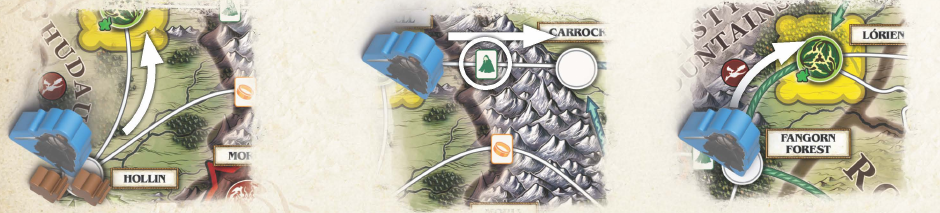
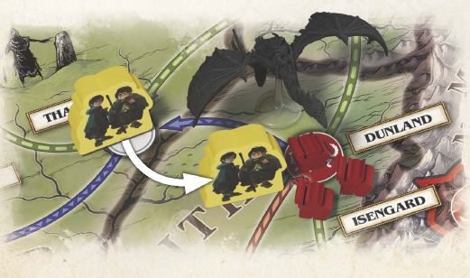
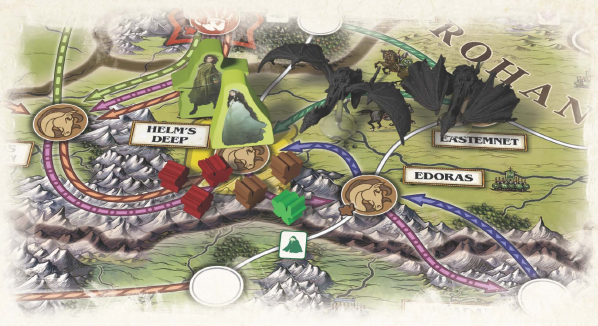
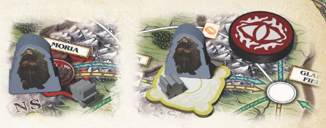
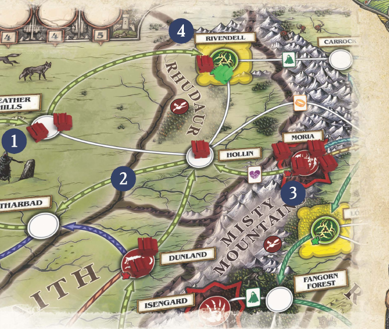

# 魔戒：远征队的宿命 — 核对后规则摘要

本文为结构化规则摘要，不是规则书逐字转录；以提供的规则书为依据。

## 你的回合：4 + 1 个行动

Source / 来源：9–10

先完成一位角色的全部行动，再换另一位。随后抽 2 张玩家卡，并按威胁度结算暗影卡。

- 多人游戏中，每位玩家控制 2 位角色：一位最多行动 4 次，另一位最多行动 1 次。谁先行动都可以，但不能分成 3 + 2，也不能交替操作两位角色。
- 可以重复执行同一种行动，每次分别计数，也可以提前结束。若只剩一位角色，该角色最多行动 4 次。
- 你的两位角色共享手牌和符号标记。角色能力可以改变一般行动规则。佛罗多和山姆合计视为一位角色；梅里和皮聘同理。
- 行动结束后，一起抽取 2 张玩家卡，再依当前威胁度逐张抽取并结算暗影卡；然后顺时针轮到下一位玩家。

## 符号与共享资源

Source / 来源：9, 20, 24

花费符号时，弃掉一张带有该符号的卡，或将一个对应符号标记归还供应堆。

- 花费卡上的符号通常不受卡牌地区限制。地区匹配用于远征队行动和部分能力，不是普通符号支付的条件。
- 手牌公开。每位玩家的上限为 7 张玩家卡，事件卡也计入；符号标记不计入。不同玩家各有自己的手牌。
- 符号标记受供应量限制；供应堆没有时，无法获得该标记。

| 符号 | 常见用途 |
| --- | --- |
| 友情（紫色双手） | 集结花费 1；部分路径与目标也需要 |
| 勇气（交叉双剑） | 战斗投骰后花费 1 移除一个暗影士兵；占领花费 3 |
| 隐身（绿色斗篷） | 佛罗多跋涉时花费 1 避免搜索；部分路径也需要 |
| 反抗（金色魔戒） | 花费 1 重投一颗搜索骰或战斗骰；摧毁魔戒需要 5 |

## 跋涉与同行

Source / 来源：10–11

花费一个行动，移动到一个连接地点。可带上起点的盟友士兵，以及同意同行的其他角色。

- 普通路径、特殊路径和战线都连接地点。角色沿战线跋涉可以双向移动；箭头只限制暗影士兵推进。
- 由执行跋涉的角色支付特殊路径上的符号费用，整支队伍只付一次。盟友士兵不能自行跋涉。
- 佛罗多自己跋涉，或被另一位角色的跋涉行动带着走时，执行行动的角色还必须额外花费 1 隐身，或在目的地投搜索骰；特殊路径费用另付。
- 单纯移动到同时有双方士兵的地点不会自动触发战斗；必须执行攻击，或有指示投战斗骰的效果。

## 搜索掷骰

Source / 来源：11, 20

佛罗多所在地区每有一个戒灵，加一颗黑色搜索骰；所在地点每有一个暗影士兵，再加一颗，最多 7 颗。

- 地区包含多个地点。戒灵影响整个地区；暗影士兵只计算佛罗多所在的具体地点。跋涉时检查目的地。
- 数量为零则不用投骰。索伦之眼本身不会额外增加一颗骰子。
- 投骰后，佛罗多所在地点的任意角色都可花费 1 反抗，重投一颗骰子；可以继续支付再次重投。
- 戴上魔戒依佛罗多角色卡的能力：失去 1 希望，将索伦之眼移到所在地区，再进行搜索，忽略当地暗影士兵但不忽略戒灵。使用时机遵照角色卡。

| 结果 | 效果 |
| --- | --- |
| 逃离（空白） | 没有效果 |
| 疲惫（树） | 失去 1 希望 |
| 暴露（有边框的树） | 失去 1 希望；位于避风港时忽略 |
| 召回（塔） | 若佛罗多所在地区有戒灵，将其中一个移到魔多；佛罗多在魔多时无效果 |

## 远征队：转交卡牌

Source / 来源：12, 20

与另一位玩家的角色位于同一地点时，花费一个行动，给予或拿取一张符合当前所在地区的卡。

- 双方必须同意。仅在同一地区、不同地点，不符合条件。
- 此行动转交的是卡牌，不能转交符号标记。你自己的两位角色本来就共享手牌。
- 若接收者超过 7 张手牌，须立即弃牌或打出事件卡，恢复至上限。

## 储备：保留符号

Source / 来源：12, 22

在避风港花费一个行动，弃掉一张地区卡，取得一个与卡上符号相同的标记。

- 多人游戏不要求卡牌地区与所在地区一致。供应堆必须有对应标记，否则不能执行储备。
- 标记不占 7 张手牌上限，但不能通过远征队行动交给其他玩家。
- 单人例外：还必须位于所弃卡牌对应的地区。

## 集结盟友士兵

Source / 来源：13

在集结地点花费一个行动和 1 友情，加入一个与该地点颜色相同的盟友士兵。

- 集结地点带有矮人、精灵、洛汗或刚铎符号。通常不能在白色或红色地点集结。
- 从对应供应堆取士兵，放到角色所在地点；该颜色供应堆为空时不能集结。
- 盟友与暗影士兵可以共处同一地点；集结本身不会触发战斗。

## 攻击与战斗骰

Source / 来源：13–14, 20

执行攻击需要角色所在地点同时有盟友士兵和暗影士兵。先将索伦之眼移到该地区，再投骰。

- 玩家攻击：选择投 1 至 3 颗白色战斗骰，但不得超过在场盟友士兵数。一次攻击只结算一次投骰，不是一直打到一方全灭。
- 暗影卡或群鸦蔽日触发的战斗：按当地暗影士兵数投骰，最多 3 颗；不会因此移动索伦之眼。
- 投骰后，当地任意角色可以支付反抗重投（每颗 1），以及支付勇气移除暗影士兵（每个 1）；这些支付不额外消耗行动。
- 当前玩家决定移除哪些颜色的盟友士兵。士兵不够移除时，移除现有数量并忽略超出部分；战后双方仍可能共存。

| 结果 | 效果 |
| --- | --- |
| 击溃（红色士兵） | 移除 1 个暗影士兵 |
| 交换（双方士兵） | 移除 1 个暗影士兵和 1 个盟友士兵 |
| 肆虐（有边框的盟友士兵） | 移除 1 个盟友士兵；位于避风港时忽略 |
| 戒灵！（飞翼） | 地区内有戒灵时移除 2 个盟友士兵；否则没有效果 |

## 占领与守护避风港

Source / 来源：14–16, 20

占领需要一个行动和 3 勇气：角色必须位于暗影要塞，至少有一个盟友士兵在场，而且没有暗影士兵。

- 把要塞变成避风港：用避风港标记覆盖图板上的要塞，或移除原避风港上的要塞标记。将索伦之眼移到该地区，并获得 2 希望。
- 占领摩瑞亚、艾辛格、多尔哥多或昂巴后，其暗影卡不再在该处加入士兵；卡牌其余特殊指令仍须执行。
- 每次战斗、行动或其他效果结算后，若避风港有暗影士兵却没有盟友士兵，立即变成要塞，并失去 3 希望。只有角色留守并不足以防守。
- 避风港可忽略搜索的“暴露”和战斗的“肆虐”，并非忽略所有不利结果。暗影士兵仍能推进进入。

## 抽取玩家卡与事件时机

Source / 来源：15, 20

行动后一起抽取 2 张玩家卡。先结算群鸦蔽日，再检查 7 张手牌上限。

- 玩家牌库耗尽时，每少抽一张卡失去 1 希望；只要希望没有归零，就不会因此直接输掉游戏。
- 打出事件不消耗行动。多数事件可在任何玩家回合使用，但除非明确允许，不能打断正在结算的搜索、战斗、卡牌或角色能力。
- 一张暗影卡完全结算后、下一张抽出前，可以打出事件。事件使用后弃掉，由打出者决定如何使用。

## 群鸦蔽日

Source / 来源：15

依顺序完整执行四个步骤。结算后移出游戏，不补抽玩家卡。

- 1. 暗影蔓延：威胁度标记向前一格。读取该格印刷的威胁度，用来决定本回合稍后抽几张暗影卡。
- 2. 我看到你了！：若索伦之眼已在佛罗多所在地区，失去 2 希望；否则把眼睛移到该地区。
- 3. 黑暗笼罩：在所示地点加入 3 个暗影士兵。供应不足时，每少放一个失去 1 希望。有盟友士兵在场则结算暗影方触发的战斗。
- 4. 危险加剧：只把暗影弃牌堆洗混，叠放到暗影牌库顶。
- 若一次抽到两张群鸦蔽日，先完整执行第一张的四步，再完整执行第二张；两张都不补抽。

## 暗影卡结算哪一半？

Source / 来源：16, 19–20

翻开一张卡后，看牌库新顶牌的牌背：红旗结算“推进”，黑色布条结算“增援”。

- 只执行翻开卡牌对应的一半，不是两半都执行。判断依据是新露出的牌库顶牌背，不是刚抽出那张的牌背。
- 逐张执行，直到达到当前威胁度所示数量。已结算的卡先留在结算区，本阶段结束后再一起进入弃牌堆。
- “战鼓响起”和“萨鲁曼之轮”两张特殊暗影卡按卡面文字执行，取代一般推进或增援效果。
- 只有最上方的暗影牌背可见。可查看双方弃牌堆，但不能偷看暗影牌库内更深处的牌背。

## 推进：整条战线移动

Source / 来源：16–17

所示战线上的每个暗影士兵都向前移动一个地点，从最前方的一组开始。

- 先移动所有士兵，再结算战斗。每个士兵只前进一次；即使起点有盟友士兵，也照样前进。
- 已经在战线终点的士兵不移动，但若有盟友士兵仍会战斗。不在该战线上的士兵不移动。
- 移动完后，从最前方向后依次结算双方士兵共处地点的战斗。按暗影士兵数投骰，最多 3 颗，不移动索伦之眼。
- 检查避风港是否失守：有暗影士兵却无盟友士兵时，变成要塞并失去 3 希望。

## 增援与戒灵指令

Source / 来源：18–19

在所示地点加入一个暗影士兵，必要时结算战斗，然后执行特殊指令。

- 一个地点的士兵数量没有上限。供应堆每缺少一个应放置的暗影士兵，失去 1 希望。
- 若所示要塞已被占领并成为避风港，跳过加入士兵，但仍结算该卡的其余部分。
- 戒灵占据地区，不是具体地点。若指令有多个同样合法的结果，由当前玩家选择。

### 移动索伦之眼

将眼睛移到佛罗多所在地区；若已在该地区，改为投搜索骰。

### 两个戒灵靠近

选取距离佛罗多最近的两个戒灵，不包含已在他所在地区的戒灵。一次移动一个，各靠近一个地区。

### 向索伦之眼部署三个戒灵

一次一个，将三个戒灵直接移到索伦之眼所在地区。优先从魔多取；魔多为空时，从目的地以外戒灵最多的地区取，每次移动后重新判断。若眼睛就在魔多，改为逐个从魔多以外最大的一组召回三个戒灵。

## 目标、希望与最后的搜索

Source / 来源：9, 12, 19

完成其余所有选定目标后，佛罗多才能尝试摧毁至尊魔戒。希望归零立即落败。

- 每张目标卡规定自己的设置、达成条件和奖励。满足后执行“完成时”效果，再把目标卡翻面。设置时注意目标要求的角色。
- 佛罗多在末日火山花费一个行动和 5 反抗，尝试最后的目标。按通常敌人数计算搜索骰，再为希望记录轨上每缺少一点希望增加一颗；总数最多 7 颗。
- 例如仅剩 3 希望，就额外加 5 颗，再应用 7 颗上限。最后搜索结束后至少剩 1 希望，团队才获胜。
- 占领要塞获得 2 希望；目标和部分能力也能恢复希望，但不得超过记录轨顶端。

| 原因 | 失去希望 |
| --- | --- |
| 疲惫／避风港外的暴露 | 每个结果 1 |
| 群鸦蔽日时眼睛已与佛罗多同地区 | 2 |
| 避风港失守 | 3 |
| 暗影士兵不足／玩家卡无法抽取 | 每缺一个／一张，失去 1 |

## 设置与难度

Source / 来源：4–8, 21, 24

先选目标，加入目标指定角色，再按玩家人数和难度准备牌库。

- 希望与威胁度标记放在记录轨印有起始圆点的格子。两张特殊暗影卡放入弃牌堆；其余暗影卡不论牌背种类，全部一起洗混。
- 依图板标记放置起始士兵：矮人 3、精灵 4、洛汗 3、刚铎 5、暗影 18。再抽 9 张暗影卡，各在所示红色地点加入一个暗影士兵，设置时忽略卡牌其余效果；这 9 张进入弃牌堆。
- 索伦之眼放在伊利雅德。9 个戒灵分别放在伊利雅德 2、鲁道尔 1、迷雾山脉 1、刚铎 1、魔多 4。所选角色依角色卡放到起始地点。
- 把随机选定的事件卡与全部 48 张地区卡洗混，分发起始手牌。剩余玩家卡尽量均分成若干堆，每堆洗入一张群鸦蔽日，再叠成牌库；较大的堆放上方。
- 持有数字最小的地区卡的玩家先手；首局建议改由控制佛罗多的玩家先手。

| 人数 | 加入的事件卡 | 每人起始手牌 |
| --- | --- | --- |
| 1 | 5 | 4 |
| 2 | 6 | 4 |
| 3 | 6 | 3 |
| 4 | 7 | 2 |
| 5 | 9 | 2 |

### 难度

入门：4 张群鸦蔽日／4 个目标。标准：5／4。英雄：5／5。史诗：6／5。传说：6／6。目标总数包含摧毁至尊魔戒。

### 首局目标

获得精灵的祝福；“萨鲁曼，你的法杖已然断折”；挑战索伦；摧毁至尊魔戒。依每张目标卡执行设置。

### 首局角色

玩家 1：佛罗多和山姆／勒苟拉斯；玩家 2：梅里和皮聘／伊欧玟；玩家 3：亚玟／亚拉冈；玩家 4：甘道夫／波罗莫；玩家 5：金雳／伊欧墨。依人数使用对应组合。

### 目标指定角色超限

两人游戏若所抽目标要求超过 4 位角色，或单人游戏超过 5 位，重新洗混目标并抽取一组。

## 单人模式

Source / 来源：22

控制佛罗多和山姆，加上另外四位角色；五位角色共享同一手牌与符号标记。

- 另外四位角色排成一列，单人标记放在最左边。标记上的角色最多行动 4 次；在其全部行动之前或之后，佛罗多和山姆可以行动 1 次。
- 照常抽 2 张玩家卡、结算暗影卡，再把单人标记右移到下一位；第四位结束后回到第一位。佛罗多不会取得单人标记，也没有四行动回合。
- 不使用远征队行动。储备除了要在避风港，还须弃掉与角色当前地区相符的地区卡。
- 使用 5 张随机事件卡，起始手牌 4 张。首局建议的四位同伴是梅里和皮聘、伊欧玟、勒苟拉斯、甘道夫。
