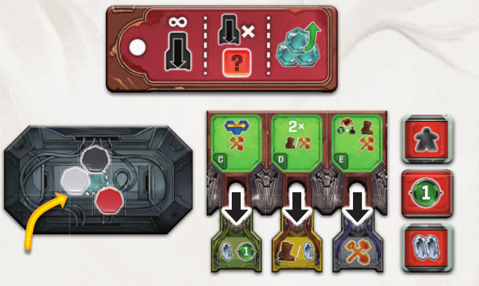
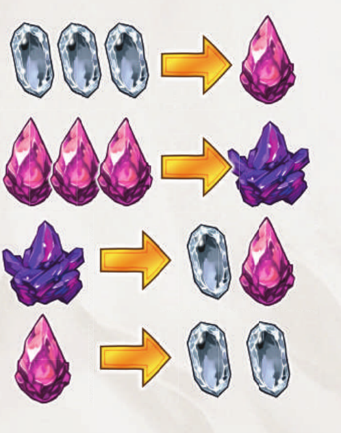
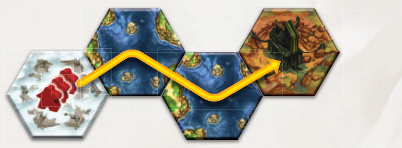
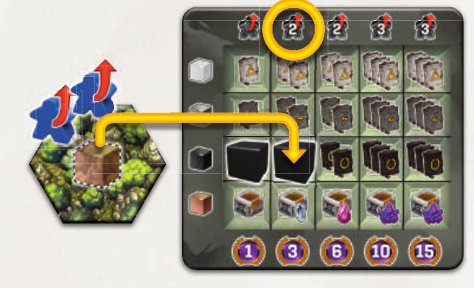
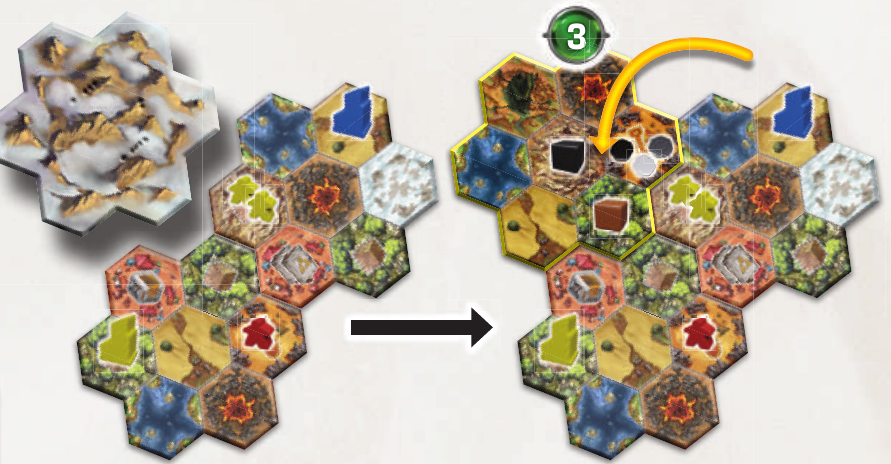
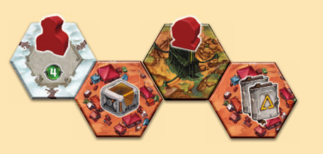
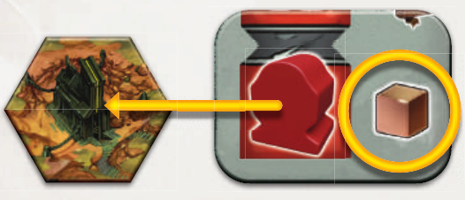
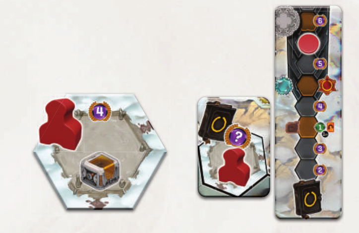
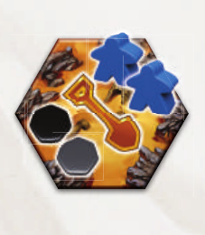

# 忆迹寻踪

依据所提供英文说明书整理的核对后规则文本，含核心流程与书中附录能力；并非所有实体卡牌与板块的逐张转录。文中指定读取组件数值时，以其印刷内容为准，不得臆测未提供的卡牌效果。

## 使用密钥卡，或回溯

普通回合二选一：把可用密钥卡插入空槽，或进行回溯。两种回合中都可搭配自由行动。

- 密钥卡同时启动自身效果和插槽正上方的行动格。各效果可选，顺序自定；但一整项移动效果必须先完成，不能被其他效果打断。

- 两张白色起始密钥卡自身没有效果。用过的卡留在槽内直到取回；效果间的斜杠表示从列出的选项中选一。

- 按顺时针行动，起始玩家始终不变。所有人完成回合后，起始玩家开始下一回合前推进沙漏。全局有13个普通轮次和4个特殊轮次。

卡牌插入C格下方的槽，卡牌效果与C格的水路移动、发展行动都会启动，顺序自定。

## 起始行动格 A–F

选择仍有空槽的行动格。回合中先获得的水晶与追随者可用于支付后续效果。

| 行动格 | 起始效果 |

| --- | --- |

| A | 获得2名追随者；可按1白买1名、1红买2名、1紫买4名的比例额外购买，合计最多加4名。还可从地图任意位置移除任意数量追随者，每名换1白水晶。 |

| B | 移动2次，或付1白／红／紫水晶改为移动3／4／5次，另外发展一次。最多付1颗水晶增强移动。 |

| C | 一次水路移动和一次发展行动。 |

| D | 移动两次、发展两次，或各一次。 |

| E | 移动一次、揭示一块区域板块、发展一次。 |

| F | 付1白水晶复制一个已用密钥卡启动的行动格。必须已有至少一个其他用过的格；复制行动格效果，不复制其卡牌。 |

## 回溯：先生产，再恢复能力

取回全部已用密钥卡。每取回一张，可启动一个可见的红色生产格，每格最多一次；最后恢复全部能力石。

- 只有从槽中取回的卡牌计入生产次数。初始有三个可见生产格，建造可露出更多。

- 回溯中可在恢复前使用自由行动，包括能力石；一旦恢复，本回合剩余时间便不能再使用能力石。

- 通过取回单张卡的图标或ION能力收回卡牌并不等于回溯：不会启动生产格，也不会恢复能力石。

取回三张已用密钥卡，可启动三个不同的可见生产格；生产后将全部能力石放回储存区。

## 补给箱、水晶与能力石

自己的回合中可使用补给箱、转换水晶和花费可用能力石，特殊轮次及回溯时也可以。

- 补给箱：获得时查看并秘密保留；使用时展示，结算效果后弃到牌堆旁。

- 将能力石放到部落、工具或已解锁的古代部落启动位，颜色不限。同一能力首次花1颗、第二次另花2颗、第三次另花3颗，以此类推，回溯后重置。

- 带固定“1”能力石图标的能力每次始终只花1颗。触发式能力每次触发事件只能启动一次，不能靠加付能力石重复同一次触发。

- 3白换1红，3红换1紫；向下拆分为1红换2白，或1紫换1红加1白。水晶升级则是将一颗水晶提高一级。

- 回合结束时，每种水晶最多保留6颗。水晶标记不限量，不足时可使用替代物。

向上兑换需要三颗低阶水晶；向下拆分不对称：一紫变一红加一白，一红变两白。

## 追随者与在场判定

新追随者放到已有自己追随者或建筑的格子，或自己的起始格。带向下箭头的放置图标则指定放到效果发生的当地格。

- 花费追随者时，将它从地图放回自己的供应区。一个大棋子代表三名追随者，可随时与三个小棋子互换。

- 追随者数量受供应区限制，没有可用棋子便不能新增；你可随时收回自己的追随者，但普通收回不给水晶，除非效果明确允许。

- 在某区域板块“在场”，指板块任意位置有至少一个自己的追随者或建筑。要求在某个六角格的条件更严格，同板块其他格的棋子不算。

## 移动与强制拾取遗物

一次移动把一组追随者从一格移到相邻一格。进入或经过遗物方块所在格，必须在当地留下足够追随者支付拾取费用，不能无视遗物直接穿过。

- 一组可包含起点的一部分或全部追随者。多次移动可分给不同组或同组连续使用，途中可合并或留下追随者；整项效果完成前不可穿插其他效果。

- 普通移动不能进入水域、火山或未揭示区域。水路移动把一整组通过相连水域从一格送到另一格，同一次水路移动不能重复经过同一水格。

- C升级的特殊水路移动可让同组追随者分散到水域相邻的不同格，这是整组同行的一项升级例外。

- 遗物放到面板同色行最左空位，获得盖住的奖励。五列费用依次为1、2、2、3、3名追随者，必须由遗物所在格支付；途经时留下这些人，于移动结束时拾取。水上遗物必须用水路移动拾取。

一次水路移动可让整组从纪念碑格经相连水域到达宝库格。

这是该玩家第二个黑色遗物方块，须从当地支付两名追随者，放入黑色第二格，并获得两步黑色知识。

## 揭示新区域

揭示板块需要你在相邻某块区域板块内在场。翻面后方向自选；相邻区域中每有一位不同玩家在场（包括自己），你得1分。

- 数不同玩家，不数棋子、建筑或相邻板块。同一玩家在多块相邻区域出现，也只贡献1分。

- 在每个遗物图标放一个随机遗物方块，每个发掘点放三颗能力石。

- 新出现的营地若与既有建筑相邻，该建筑主人立即得到营地奖励，仍遵守每位玩家每个营地只领一次。

红色揭示板块。黄、红、蓝三位玩家在相邻区域在场，因此红色得3分，再补上遗物方块和发掘点能力石。

## 发展：建造、发掘或升级

一次发展可在有自己追随者的格子建造或发掘，也可改为升级一颗水晶。建造的当地追随者费用为1名，加上该格每位已有建筑的其他玩家各1名。

- 每位玩家每格最多一座建筑，不同玩家可共处。同格建造的全部追随者费由该格支付；每位已在该格建造的对手各向该格放入一名追随者。

- 发掘始终只需当地一名追随者，不受其他建筑或玩家影响。建造或发掘还须支付对应水晶费用。

- 营地旁建造立即拿奖励，每人每个营地最多一次。一座建筑可触发多个尚未领过的营地。发掘不触发营地；营地格可进入，但不能建造或发掘。

黄方在红蓝两家已有纪念碑的格子建造，支付当地三名追随者；红蓝各在此格获得一名追随者。

新宝库邻接两个营地。红方之前已通过纪念碑拿过左营地奖励，这次只领取右营地奖励。

## 宝库、工坊与纪念碑

建筑类型由地形决定。支付当地追随者及所需水晶，从玩家面板取下建筑放到地图。

| 建筑 | 费用、顺序与奖励 |

| --- | --- |

| 宝库 | 限宝库格；不花水晶。任取一座剩余宝库，无顺序限制，立即获得右侧奖励。遗物奖励从版图右下供应区拿一个方块，不额外花追随者，再领放入面板后的奖励。 |

| 工坊 | 田野／森林／山地。对应地形列自下而上建造并支付印刷水晶费；分别拿黄／绿／灰密钥卡，绿或灰展示区立即补牌。只能从展示区选择，牌可能用完。 |

| 纪念碑 | 限纪念碑格；取最下方剩余纪念碑，付印刷水晶费。主版图预印地点终局按对应知识轨得分；区域板块上的地点由首位建造者选一块可用纪念碑板块，之后该处建造者都按其图标时机获得奖励（即时或终局）。 |

选择这座宝库后，从右下供应区拿一个可用遗物方块，不为这个方块额外支付追随者。

力量道路会计算这两种纪念碑；其B面专精只重复左侧纪念碑板块的分数，不重复右侧知识轨地点。

## 能力石越少，发掘越贵

一次发展只拿一颗能力石。支付发掘格内一名追随者，再按本次行动开始时剩余的石头数量支付水晶。

| 剩余能力石 | 水晶 | 所取能力石颜色的知识 |

| --- | --- | --- |

| 3 | 1白 | 2步 |

| 2 | 1红 | 3步 |

| 1 | 1紫 | 4步 |

剩两颗时，第一次发掘付一名追随者加一红，得3步知识；第二次行动拿最后一颗，再付一名追随者加一紫，得4步知识。

## 知识解锁古代部落

到第3步拿一件工具，第一位还揭示古代部落并得1分。到第5步拿自己的彩色能力石，并解锁该部落的全部能力。

- 第一位到达或经过第3步者翻开部落及四件工具并选一件；另外三件保持正面，后续达到该步的玩家各选一件剩余工具。

- 第5步把对应锁定板块从面板移到古代部落牌上。主动能力通过自己已解锁的启动位花能力石使用，被动能力也生效；多人可同时解锁同一部落。

- 到达或经过奖励标记就拿奖励，标记留给其他玩家继续使用。不能超过轨道末端，多余知识失去。

## 文化分与行动升级

绿色分数立即获得，紫色分数终局结算。文化轨到达或经过升级图标时，从该处旁边的牌堆拿一块升级板块。

- 升级板块正反面选一面，装到相同字母的行动格，永久增强该格。

- 若本回合已用过该行动格的任何效果，新升级效果须等以后回合；若原效果一个都还没用，本回合即可用升级版。

- 终局计分开始后，文化分不再触发升级板块。

## 特殊轮次：道路与目标

时间板到达图示位置时，顺时针结算该特殊轮次。仍可做自由行动，但不能使用密钥卡或回溯。

- 三次道路选择分别从该组两张道路卡中选一张放标记，立即领其关联的深色奖励标记效果，并在终局获得该道路的专精加分。

- 弃目标特殊轮次中，从两张目标牌弃一张并立即拿该牌底部奖励；另一张秘密保留用于终局，不能领取保留牌底部奖励。

- 沙漏到最终格结束游戏。六条道路每人都计分，不是只计你专精的三条。

## 六条道路：基础分与专精

六张道路卡自下而上全部计分，只有放了自己标记的三张再加下半部专精奖励，并使用开局选定的A或B面。

| 道路 | 所有人基础分 | 专精 A／B |

| --- | --- | --- |

| 知识 | 每条知识轨已达到的最高分数图标。 | A：再计一次得分第二高的知识轨。B：每条至少到第7步的轨道加4分。 |

| 先民 | 每颗白、灰、黑能力石2分；玩家色能力石不算。 | A：每颗合资格能力石另加2分。B：每套白灰黑加7分。 |

| 传奇 | 每座已建宝库2分。 | A：每座加2分。B：每完整两座加5分。 |

| 效率 | 全部密钥卡的印刷分数，槽内卡也算。 | A：每张黄绿灰卡加2分。B：每张灰卡加3分。 |

| 雄心 | 各色遗物行只计最右已占列的分数：1／3／6／10／15。 | A：每套白灰黑棕加6分。B：最高分颜色再计一次。 |

| 力量 | 各纪念碑地点的分数；主版图预印地点按对应知识轨得分。 | A：每座加3分。B：只重复纪念碑板块分数，不重复知识计分地点。 |

## 剩余资源、目标与胜负

道路之后计算剩余资源和保留目标。文化分最高者胜；平局依次比较白、灰、黑知识轨。

- 水晶折白：白=1、红=2、紫=3，加上地图上的追随者总数，每完整3单位得1分，合计后统一向下取整。此次转换忽略储存上限。

- 展示保留目标，满足其全部要求得15分；未完成不计分。

- 三个知识轨也完全平局则共享胜利。使用可选伴侣网站时，可与先民分数比较并存档自己的文明。

## 部落能力速查

主动能力花能力石，被动能力始终免费生效；解锁古代部落后两种能力都获得。触发式能力每次触发只可启动一次。

### AYNIR

主动：按部落牌所列兑换最多四次，可混合追随者、水晶与文化分；文化轨后退不失去已有升级。被动：2白可换1红，2红可换1紫。

### BISHOP

主动：执行一次发展行动。

### COLTERON

主动：将一组追随者从一个火山格移到另一个火山格，并得1白水晶。被动：可以进入火山格。

### DORIAN

主动：在有自己追随者或建筑的田野格放猪场，按该格猪图标数放猪，每格最多一个猪场。被动：移动时可带猪；与自己追随者同格的猪可替代追随者支付发展或拾遗物费用。终局：每个有自己追随者或建筑的猪场2分。多位使用DORIAN能力的人均可带走这些猪，并按在场情况计算任意猪场，不看建造者。

### ENTERIN

主动：在自己追随者或建筑相邻的空水域、田野、森林或山地格放岛屿。该格同时视为水域和森林，所有人均可用普通或水路移动进入。每个相邻的有任意玩家建筑的格子提供一次奖励：工坊给1白水晶，宝库给一名放在岛上的追随者，纪念碑给1分；数格子，不数建筑数量。

### FINDER

主动：将自己的筏放到或移到任意空水格，无需相邻，并从供应区放三名追随者到筏上，他们尚不算在场。被动：任何玩家在筏旁一格花费一名或更多追随者时，从筏上移一名到该格；筏空时移除。

### GOLIAT

获得知识轨或道路奖励标记效果时，可启动以再得一次该效果，每次标记触发最多启动一次。

### HAYLA

主动二选一：一组跳过一个格（可跳过水域、火山或遗物格）；或一个格里的每名追随者各移动到相邻格，可分散也可同去。

### ION

主动：取回一张已用密钥卡，不触发生产或恢复能力石。

### J’HE

使用密钥卡时可启动，再得一次卡牌效果；重复的是卡牌，不是行动格。

### K01

建宝库时可启动，重复所选宝库奖励。若选遗物，只拿一个方块，但该方块放入玩家面板所给奖励翻倍。

### LEXANDER

主动：升级一颗水晶。被动：行动中每花一紫水晶，得1白水晶和1分；把紫拆成红加白不触发。

### MAYFAIR

主动另付1白水晶，将一张密钥卡升一级：白→黄→绿→灰。

### NORTHER

主动：移动一组一次。被动：在营地格花一名追随者放随机圆环并获其奖励；所有玩家合计，每个营地最多放一个圆环。

### 空格的定义

空格指没有建筑、追随者、遗物方块或特殊板块的格子。

## 工具与密钥卡图标

工具遵守普通能力石费用，除非图标写明固定费用；注意能力能自由选择时机，还是必须等待特定事件触发。

- 升级密钥卡：白起始卡移出游戏，黄卡放回其堆，绿卡放到其堆底，再从展示区拿下一颜色一张；绿灰展示区照常补牌。可升级槽内已用卡，但新卡放回原槽，不立即启动。

- 免费启动图标让你不花能力石启动一个工具或部落效果；取卡图标收回一张已用卡，但不生产。

### ALEMBIC（蒸馏器）

从地图任意位置花一名追随者，得1红水晶。

### BOOSTER（增幅器）

拿遗物时可启动，额外得1红水晶。

### DECRYPTOR（解码器）

建宝库时可启动，得一步知识。

### EXOSUIT（外骨骼）

免除一次发展或一次拾遗物的全部追随者费。以此建造时，同格已有建筑的对手不获得追随者。

### GPR（探地雷达）

发掘时可启动，额外获得所取石头颜色的一步知识。

### INTERPRETER（译码器）

在营地旁建造并获得营地奖励时，可启动以得一步知识。一座建筑获得多个营地奖励时，每个营地各算一次触发。

### JOLTWELL

回溯中重复一个生产格奖励。同一次回溯，每个生产格各可触发一次。

### OMNITOOL（多功能工具）

四项印刷能力视作四件独立工具，分别计算启动费用。

### PORTAL（传送门）

将一名新追随者放到有对手建筑的格子，或正常放在有自己追随者或建筑的格子。

## 目标条件速查

保留目标的全部图示条件都满足才得15分。图标旁数字是最低要求，不是恰好等于。

- 遗物图标依图示要求同色至少2或3个、至少3种不同颜色，或四种颜色齐全。

- 能力石图标要求白灰黑各至少一颗，或这三色合计至少5颗；不包含玩家色能力石。

- 其他图标要求至少指定数量升级、已建宝库、已建纪念碑或建筑相邻的不同营地；至少7张密钥卡（含起始卡）；解锁全部三个古代部落；或在至少六块不同区域板块有建筑。

## 开局设置速查

起始拥有3白水晶、2白密钥卡、1颗可用能力石、2张秘密目标，以及自己序号起始格中的3名追随者；选择一组部落与配套工具。

- 六个浅色奖励随机放知识奖励位，六个深色奖励随机放版图左侧奖励位。六张道路卡随机排列，初玩全用A面。八块纪念碑板块随机留五块入场，其余归盒；24个补给箱洗混成背面堆。

- 升级按A–F字母分类成六堆，随机配到文化轨升级图标旁。黄卡按三种类型正面堆放；绿、灰分别洗混，各展示三张。

- 右下供应区放四色遗物各一个；其余24方块及27颗白灰黑能力石入袋。两块S起始区域正面随机方向放置；单人及双人时，右侧起始板块改背面朝上。其余十块洗混背面放置，给已揭示板块的遗物符号和发掘点补组件。

- 四颗玩家色能力石，一颗放面板，三颗各放一条知识轨旁。标记放文化起点、三条知识起点、三组道路选择区。面板摆六宝库、六工坊、五纪念碑、三锁。其余追随者与水晶标记放供应区。

- 随机选永久起始玩家，沙漏放第一格。按顺时针序号，每人向对应起始格放三名追随者。

- 展示玩家人数+1张随机部落，各配一件随机工具。从起始玩家右手边开始逆时针各选一组；未选组归回各池。新玩家也可改为随机发部落和工具。

- 剩余部落洗混，三个古代部落位各背放一张；剩余工具洗混，每处工具位各背放四块，其余不看地归盒。使用可选伴侣网站时登记初始部落，古代部落可等发现再设置。

- 筏、岛屿、圆环、猪场和猪等专属组件先放旁边，相关部落入场才使用。

## 单人与可选变体

单人：起始格可选1或2，起始抽三张目标；正常特殊轮次弃一张，必须完成留下的两张才获胜，但目标合计仍只得15分。

- 同一组件不能同时用于两张单人目标。两张各要三色遗物，需两套；两张各要四宝库时，供应只有六座，无法同时完成。任一保留目标未达成即单人失败。

### 回旋轮抽

不选固定配对，先从起始玩家右侧开始逆时针各选一个部落或工具，再从起始玩家开始顺时针各选另一种，最后每人各一。

### 已知古代部落

开始前展示三个古代部落及工具；各轨首达第3步者仍得1分。

### 自由选择升级

每人持一套A–F升级；达到升级图标时，自选安装哪块，不按该处固定牌堆取。
